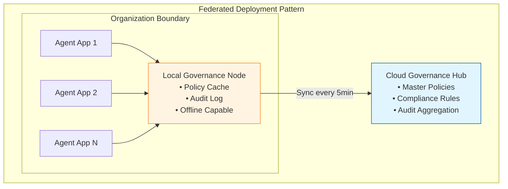
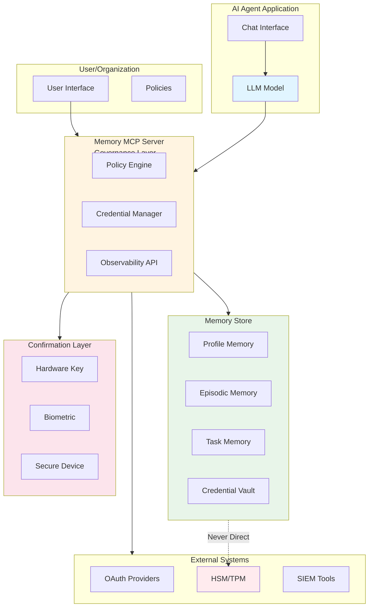
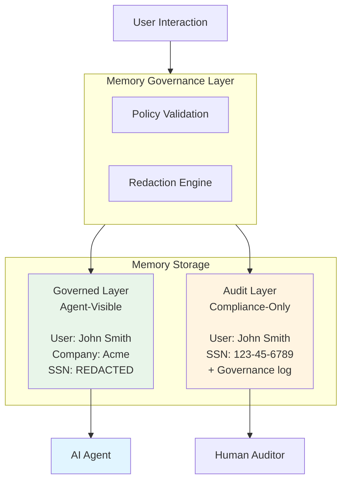

# Constitutional Memory: Governance Infrastructure for Persistent AI Agents

## Abstract

As AI agents transition from stateless language models to persistent systems with delegated authority, **memory becomes governance-critical infrastructure**. Treating memory as an emergent property of prompts, embeddings, or logs produces ungoverned state that undermines security, compliance, reliability, and trust.

This document proposes **constitutional memory**: a framework in which memory is a first-class, inspectable, and policy-governed subsystem, distinct from the language model itself. The framework separates pattern recognition (models) from authority, persistence, and enforcement (systems), enabling agents to operate with meaningful capability while remaining auditable, revocable, and compliant.

Constitutional memory is not a monolithic product or a mandate to replace existing standards. It is a **governance layer** that integrates with established identity, access management, cryptographic, and audit infrastructures. Its goal is to enable persistent, background-capable agents without creating opaque or uncontrollable state.

---

## Table of Contents

1. [Introduction](#1-introduction)
2. [The Memory Problem](#2-the-memory-problem)
3. [Core Principles](#3-core-principles)
4. [Architecture Overview](#4-architecture-overview)
5. [Credential Management](#5-credential-management)
6. [Multimodal Confirmation Patterns](#6-multimodal-confirmation-patterns)
7. [Technical Specification](#7-technical-specification)
8. [Integration with Existing Standards](#8-integration-with-existing-standards)
9. [Security & Compliance](#9-security--compliance)
10. [Memory Coherence & Transparency](#10-memory-coherence--transparency)
11. [Performance & Operational Reality](#11-performance--operational-reality)
12. [Implementation Approach](#12-implementation-approach)
13. [Open Questions](#13-open-questions)
14. [Conclusion](#14-conclusion)

---

## 1. Introduction

### 1.1 Context

The AI landscape is undergoing a fundamental shift. Language models are evolving from stateless question-answering systems into persistent agents that:

- Remember user preferences and conversation history
- Maintain task state across sessions
- Access external systems on behalf of users
- Make autonomous decisions within delegated authority
- Operate continuously in background modes

This transition creates a critical infrastructure gap: **how do we govern agent memory in a way that is secure, compliant, auditable, and enables genuine capability?**

### 1.2 The Stakes

**Compliance**: Regulations like GDPR, CCPA, and industry-specific standards (HIPAA, PCI-DSS) require explainability, deletion rights, and secure credential storage.

**Security**: Ungoverned memory creates attack surfaces for prompt injection, credential theft, and persistent backdoors that survive across sessions.

**Capability**: Agents that cannot safely store credentials are limited to read-only tasks, unable to act as true digital representatives.

**Trust**: Users will not adopt agents they cannot inspect; organizations will not deploy systems they cannot audit.

**Fragmentation**: Without standards, every vendor builds proprietary memory systems, creating lock-in and incompatibility.

### 1.3 Scope and Non-Goals

This document:

1. **Analyzes** current memory approaches and their limitations
2. **Proposes** constitutional memory as a governance framework
3. **Specifies normative requirements** for safe persistent agents
4. **Recommends patterns** for credentials and confirmation
5. **Provides illustrative examples** for voice-first and multimodal interaction
6. **Identifies** open questions requiring community input

**This document does NOT**:
- Define a new identity standard (integrates with existing IAM)
- Replace OAuth, FIDO2, HSMs, or SIEMs (builds on them)
- Assume universal biometric availability (offers multiple confirmation primitives)
- Mandate specific implementation details (defines interfaces and contracts)

---

## 2. The Memory Problem

### 2.1 Current Approaches

Modern AI agents employ various memory strategies:

**Vector Stores**: Embed past interactions and retrieve via similarity search. Effective for contextual recall but depends heavily on chunking strategy and retrieval quality.

**Structured Memory**: Maintain explicit schemas (user profiles, goals, constraints). Works well for predictable domains but requires careful design.

**Episodic Memory**: Store conversation snapshots with metadata (time, importance, sentiment). Provides narrative continuity but can grow unwieldy.

**Summarization**: Periodically compress interactions into rolling summaries. Efficient but risks losing nuance.

**Reinforcement Learning**: Update internal policies based on experience. Adaptive but opaque and hard to control.

**External Knowledge Bases**: Write to databases, wikis, or knowledge graphs. Persistent and queryable but lacks governance.

**Hybrid Architectures**: Combine multiple layers for comprehensive memory coverage.

### 2.2 The Fundamental Flaw

All current approaches share a critical weakness: **they assume the language model should manage memory**.

LLMs are pattern recognizers, not control systems. They cannot reliably:

- Detect what information is important to store
- Decide when retrieval is appropriate
- Maintain consistency across writes
- Enforce compliance policies
- Understand long-term continuity
- Safely manage credentials

**Asking models to orchestrate memory is like asking a search engine to manage your filesystem—the capabilities don't match the responsibility.**

### 2.3 Observed Failure Modes

Across current agent implementations, the same classes of failure recur:

**Under-retrieval**: Agent fails to recall relevant context, providing inconsistent responses.

**Over-retrieval**: Agent retrieves irrelevant memories, creating noise and degrading performance.

**Hallucinated Writes**: Agent "stores" information in a way that appears to work but doesn't persist.

**Missing Writes**: Critical information goes unrecorded because the model didn't recognize its importance.

**Inconsistent State**: Multiple writes create conflicting memories without resolution.

**Tool Misuse**: Model calls memory tools in incorrect formats or inappropriate contexts.

**Credential Exposure**: Sensitive tokens stored in unencrypted chat logs or vector databases.

**These failures are not model bugs. They are governance gaps.**

### 2.4 The Capability Gap

Beyond safety concerns, current approaches limit agent utility:

- **No Delegated Authority**: Agents can discuss but not execute
- **Manual Auth Every Time**: Users must re-authenticate for each action (unusable UX)
- **Read-Only by Default**: Agents remain glorified search interfaces
- **No Background Operation**: Can't monitor systems and act proactively

Users expect agents to "just handle it"—book flights, pay bills, manage infrastructure. This requires safe credential storage and delegation, which current memory approaches don't provide.

---

## 3. Core Principles

The following principles define the minimum requirements for constitutional memory. They are **non-optional** for safe persistent agents.

### 3.1 Explicit, Not Emergent

Memory is a **first-class subsystem** with clear read/write semantics, not an accidental side effect of logs, caches, or model weights.

**Requirements**:
- Memory operations must be explicit API calls
- Memory types must be formally defined (profile, episodic, task, credentials, KB)
- Memory lifecycle must be governed (creation, access, expiration, deletion)

**No hidden persistence. No emergent behavior.**

### 3.2 Observable, Not Hidden

Every stored memory must be:

- **Inspectable**: Users can view what's stored
- **Queryable**: Search and filter by type, time, importance
- **Auditable**: Full history of who wrote what, when, and why
- **Deletable**: Users can remove specific memories or entire categories

**Full transparency. No unauditable state.**

### 3.3 Governed, Not Trusted

The model **proposes** memory operations; the system **enforces** policy.

**Requirements**:
- Rules, filters, and veto points between "LLM proposes X" and "X is persisted"
- Content validation (PII detection, redaction, rejection)
- Access control (who can read/write which memory types)
- Compliance enforcement (retention policies, consent requirements)
- Credential tiering (what requires human confirmation)

**The model is memory-literate; the system is memory-sovereign.**

### 3.4 Capability-Enabling, Not Just Protective

Governance exists to enable **safe capability**, not to eliminate capability entirely.

**Requirements**:
- Tiered credential management with human-in-the-loop confirmation
- Delegated authority within explicit bounds
- Audit trails that support capability, not just restriction

**Safety through governance, not limitation.**

### 3.5 Distributed, Not Centralized

Governance must not create single points of failure.

**Requirements**:
- Multiple governance deployment patterns (centralized, federated, distributed)
- Graceful degradation when governance layers are unavailable
- Policy caching and offline operation capabilities
- Health monitoring and circuit breakers

**Availability through distribution, not monolithic architecture.**

---

## 4. Architecture Overview

### 4.1 Separation of Responsibilities

| Layer | Responsibility | Normative Requirement |
|------|----------------|----------------------|
| **Model** | Pattern recognition, language, proposals | Must NOT enforce policy or exercise authority |
| **Memory Governance** | Policy enforcement, validation, routing | Must validate all operations against policy |
| **Persistence** | Durable storage, encryption | Must encrypt at rest, support lifecycle ops |
| **Authority Layer** | Identity, credentials, confirmation | Must enforce least-privilege access |
| **Human** | Final authority for sensitive actions | Must retain control over Tier 3+ credentials |

### 4.2 Governance Deployment Patterns

Constitutional memory supports multiple deployment architectures:

**Centralized**: Single governance server (simple, suitable for development)
**Federated**: Local governance nodes with cloud synchronization (enterprise deployments)
**Distributed**: Full consensus-based mesh (critical infrastructure)

Organizations choose the pattern that matches their scale and requirements.



### 4.3 System Architecture



### 4.4 Failure and Degradation Modes

A governed system must fail safely:

**If confirmation fails** → deny by default  
**If policy evaluation times out** → deny or degrade to read-only  
**If observability is unavailable** → restrict writes until restored  
**If credential tier cannot be determined** → treat as Tier 3 (require confirmation)  
**If governance layer unreachable** → use cached policies, then degrade to read-only

**Availability does not override authority.**

Configuration example:

```yaml
failure_modes:
  governance_unreachable:
    immediate: use_cached_policies
    after_timeout: degrade_to_read_only
    
  policy_conflict:
    resolution: most_restrictive_wins
    audit_log: true
    
  cache_stale:
    max_age: 1h
    stale_while_revalidate: true
```

---

## 5. Credential Management

### 5.1 Normative Requirement

Persistent agents **must not** hold unrestricted credentials. Credential use must be:
- Scoped to specific actions
- Auditable with full logging
- Revocable at any time
- Time-limited where appropriate

### 5.2 Tiered Credential Model

Constitutional memory provides **four credential tiers** balancing capability with safety. **The tier determines the confirmation and execution path.**

#### Tier 1: Public/Low-Risk Credentials

**Definition**: API keys for read-only public data, non-sensitive services

**Storage**: Encrypted at rest, standard memory governance

**Access**: Agent can use autonomously

**Examples**:
- Weather API key
- Public search API token
- Read-only database credentials

**Policy**:
- Store encrypted
- Audit all access
- Rotate regularly

**Risk Level**: Low (limited blast radius if compromised)

---

#### Tier 2: Delegated Authority Credentials

**Definition**: OAuth tokens with specific scopes, time-limited access

**Storage**: Encrypted, scope-limited, with expiration

**Access**: Agent can use within scope boundaries

**Examples**:
- "Calendar read/write" OAuth token
- "Send email as user" permission
- "Read Slack messages" scope

**Policy**:
- Require explicit user grant (OAuth-style consent flow)
- Scope enforcement at memory layer
- Automatic expiration/refresh per OAuth standard
- Full audit trail of all uses

**Risk Level**: Medium (scoped to specific capabilities, time-limited)

---

#### Tier 3: Sensitive Credentials (Human-in-the-Loop)

**Definition**: Credentials enabling financial transactions, data deletion, security changes, admin operations

**Storage**: Encrypted with additional protection layer (separate key, secure enclave)

**Access**: **Requires real-time human confirmation via one of multiple primitives**

**Examples**:
- Payment card credentials
- Database admin passwords
- Production deployment keys

**Confirmation Primitives** (policy-selectable):
- **Hardware keys**: FIDO2/YubiKey physical confirmation
- **Secure device approval**: Push notification to trusted device
- **Biometric authentication**: Voice biometric or facial recognition
- **Passphrase challenge**: User types or speaks specific phrase
- **Out-of-band confirmation**: SMS or email with unique code
- **Time-window delegation**: "Approve all X under $Y for next Z hours"

**Policy**:
- Confirmation method selected based on risk, context, and user preference
- Spending/action limits enforced at system level
- Full audit trail including confirmation proof
- Revocable at any time
- Supports graduated delegation

**Risk Level**: High (real financial/security impact if misused)

---

#### Tier 4: Cryptographic Secrets (Never in Memory)

**Definition**: Private keys, root passwords, HSM-protected secrets

**Storage**: **External secure enclave only** (HSM, TPM, OS keychain)

**Access**: Agent **never sees the secret**; requests operation, system performs in secure context

**Examples**:
- Code signing private keys
- Encryption private keys
- Root CA certificates

**Usage Pattern**:
```
Agent:  "I need to sign this release binary"
System: [Loads private key in HSM]
        [Signs binary in secure context]
        [Returns signature to agent]
        [Private key never leaves HSM]
```

**Policy**:
- Never enter agent memory under any circumstances
- Only operation result returned to agent
- May require multi-party approval (dual control)

**Risk Level**: Critical (catastrophic if leaked)

---

### 5.3 Credential Classification Decision Tree

To eliminate ambiguity in tier assignment, use this decision process:

```yaml
credential_classification:
  step_1_financial_impact:
    question: "Can this credential result in direct financial loss?"
    yes: proceed_to_step_2_amount
    no: proceed_to_step_2_data
  
  step_2_amount:
    question: "Maximum single-transaction impact?"
    under_100: tier_3_with_limits
    100_to_10000: tier_3_with_confirmation
    over_10000: tier_3_with_dual_approval
  
  step_2_data:
    question: "Most sensitive data accessible?"
    public_data: tier_1
    user_content: tier_2
    pii_non_financial: tier_2_with_scopes
    pii_financial: tier_3
    phi_healthcare: tier_3
    infrastructure_secrets: tier_4
  
  step_3_destructive:
    question: "Can this irreversibly delete/modify data?"
    yes: upgrade_tier_by_1
    no: keep_current_tier
  
  step_4_blast_radius:
    question: "Impact if compromised?"
    single_user: current_tier
    organization_wide: tier_3_minimum
    production_infrastructure: tier_4
```

### 5.4 Credential Examples Matrix

Concrete examples for 40+ common credential types:

| Credential Type | Tier | Rationale | Confirmation |
|-----------------|------|-----------|--------------|
| **Development & Code** |
| GitHub PAT (read repos) | T1 | Public/read-only | None |
| GitHub PAT (write repos) | T2 | User content only | OAuth consent |
| GitHub PAT (org admin) | T3 | Org-wide impact | Hardware key |
| Code signing private key | T4 | Critical if leaked | HSM only |
| npm publish token | T3 | Supply chain risk | Per-publish confirm |
| **Cloud Infrastructure** |
| AWS key (read-only role) | T1 | Limited blast radius | None |
| AWS key (EC2 start/stop) | T2 | Scoped write | OAuth-style |
| AWS key (S3 delete) | T3 | Destructive | Per-action confirm |
| AWS root credentials | T4 | Full org control | HSM + MFA |
| GCP service account (viewer) | T1 | Read-only | None |
| GCP service account (editor) | T2 | Scoped writes | Delegation |
| GCP service account (owner) | T3 | Full project access | Confirmation |
| **Communication** |
| Slack read token | T1 | Public channels | OAuth consent |
| Slack write (user scope) | T2 | User messages only | OAuth consent |
| Slack write (workspace) | T3 | Organization-wide | Confirmation |
| Gmail OAuth (read) | T1 | User email only | OAuth consent |
| Gmail OAuth (send) | T2 | Can send as user | OAuth + review |
| **Productivity** |
| Google Calendar (read/write) | T2 | User calendar | OAuth consent |
| Google Drive (read) | T1 | User files | OAuth consent |
| Google Drive (write) | T2 | User files | OAuth consent |
| Google Drive (delete) | T3 | Irreversible | Per-action confirm |
| **Payment & Financial** |
| Stripe API (test mode) | T1 | No real money | None |
| Stripe API (live, read) | T2 | Financial data | OAuth consent |
| Stripe API (live, charge) | T3 | Direct financial impact | Confirm + limits |
| Credit card (stored) | T3 | Direct charges | Time-windowed |
| Bank account credentials | T4 | Full account access | External vault |
| **Healthcare** |
| EHR API (read patient data) | T3 | HIPAA PHI | MFA required |
| EHR API (write prescriptions) | T3 | Medical liability | Dual approval |
| Medical device control | T4 | Patient safety | Hardware isolation |
| **Databases** |
| Database read-only user | T1 | No writes | None |
| Database app user | T2 | Scoped writes | Connection string |
| Database admin user | T3 | Full DB control | Per-action confirm |
| Database root password | T4 | Cluster control | HSM |

### 5.5 Justification Is Advisory, Not Authoritative

Agent-provided justifications for credential use:
- Are treated as **signals**, not truth
- Are scored against context and history
- May trigger human review queues
- **Never serve as sole authorization**

The system never relies solely on the model's stated intent.

---

## 6. Multimodal Confirmation Patterns

### 6.1 Status of This Section

**This section is illustrative and recommended.**

The core requirement is: **Tier 3+ credentials require human confirmation via policy-defined primitives.**

The specific UX patterns below are **recommendations** for voice-first and multimodal interfaces.

### 6.2 Design Constraints

Any confirmation UX must:
- Require explicit approval (no ambiguity)
- Resist spoofing and replay attacks
- Provide context proportional to risk
- Offer non-voice/non-biometric alternatives
- Support accessibility requirements

**Voice/biometrics are transports, not trust anchors.**

### 6.3 The Interface Shift

User interfaces are transitioning toward voice/gesture in specific contexts:

- Smart speakers and ambient devices
- AR/VR headsets with gaze and gesture input
- Automotive interfaces requiring hands-free operation
- Accessibility technologies for users with mobility impairments
- Wearables with limited screen space

**Implication**: Confirmation flows designed only for clicking buttons may become unusable in these contexts.

### 6.4 Voice Confirmation Pattern

**Scenario**: High-stakes action in voice-first context

```
User:   "Book me a flight to Tokyo next week"
Agent:  [Searches flights]
        "I found United flight UA837 departing January 30.
         
         To book this, I need to charge $487 to your Visa ending in 4242.
         
         Say 'approve' to confirm, or 'show details' for more."

User:   "Approve"
System: [Confirmation primitive: matches against enrolled voiceprint]
        [Context validation: request matches user's original ask]
        [Optional: Additional factor if policy requires]
Agent:  "Booking confirmed. Confirmation code JK7392."
```

**Key Properties**:
- Explicit approval phrase required
- Context-rich prompt
- Liveness/anti-replay checks in background
- Fallback to other primitives if voice unavailable

### 6.5 Multimodal Pattern: Voice + Visual

For destructive actions, combine modalities:

```
User:   "Delete the production backup from last month"

Agent:  [Visual display]:
        ┌─────────────────────────────────────┐
        │ ⚠️  DESTRUCTIVE ACTION              │
        │                                     │
        │ Delete: prod_backup_2025-12        │
        │ Size: 47 GB                        │
        │                                     │
        │ This cannot be undone.             │
        │                                     │
        │ Say "confirm deletion" OR          │
        │ Use hardware key for approval      │
        └─────────────────────────────────────┘
        
Agent:  [Voice] "This is permanent. Say 'confirm deletion' or 
                 use your security key."

User:   [Option 1: Voice] "Confirm deletion"
        [Option 2: Hardware key] [Taps YubiKey]
        
System: [5-second countdown if voice; immediate if hardware key]
Agent:  "Backup deleted. Audit log created."
```

### 6.6 Delegation Pattern

**Time-Windowed Delegation**:
```
User: "I'm booking travel today. Auto-approve flights under $2000."
Agent: "Understood. Until midnight, I can book flights up to $2000 
       without per-transaction confirmation.
       
       Each booking will be logged and you'll receive notifications.
       Say 'stop auto-approval' at any time to revoke."
```

**Emergency Revocation**:
```
User: "Stop! Cancel all agent access to my payment info"
System: [Immediate credential revocation]
Agent: "All payment credentials revoked. Delegation canceled."
```

---

## 7. Technical Specification

### 7.1 Memory MCP API

The Memory Model Context Protocol (Memory MCP) provides a standardized interface for constitutional memory operations.

#### Core Memory Types

```typescript
enum MemoryType {
  PROFILE = "profile",      // User facts, preferences
  EPISODIC = "episodic",    // Conversation history
  TASK = "task",            // Goals, workflow state
  KNOWLEDGE = "knowledge",  // Documents, artifacts
  CREDENTIAL = "credential" // Credentials (tiered)
}

interface Memory {
  id: string;
  type: MemoryType;
  content: string;
  metadata: MemoryMetadata;
  governance: GovernanceMetadata;
}

interface MemoryMetadata {
  created_at: Date;
  updated_at: Date;
  importance: number;  // 0.0-1.0
  tags: string[];
  ttl?: string;        // "90d", "1y", etc.
}

interface GovernanceMetadata {
  policy_version: string;
  redactions: Redaction[];
  validation_results: ValidationResult[];
  audit_trail: AuditEntry[];
}
```

#### Memory Operations

```typescript
interface MemoryOperations {
  // Write operations (require governance validation)
  write(memory: Memory, justification: string): Promise<WriteResult>;
  update(id: string, content: string, justification: string): Promise<WriteResult>;
  delete(id: string, reason: string): Promise<DeleteResult>;
  
  // Read operations (subject to access control)
  read(id: string): Promise<Memory>;
  query(filter: MemoryFilter): Promise<Memory[]>;
  search(query: string, type?: MemoryType): Promise<Memory[]>;
  
  // Observability
  list(type?: MemoryType): Promise<MemorySummary[]>;
  audit(id: string): Promise<AuditEntry[]>;
  export(format: "json" | "xml"): Promise<string>;
  
  // Lifecycle
  archive(id: string): Promise<void>;
  restore(id: string): Promise<Memory>;
  destroy(id: string, confirmation: DestructionConfirmation): Promise<void>;
}

interface WriteResult {
  success: boolean;
  memory_id?: string;
  policy_violations?: PolicyViolation[];
  governance_actions?: GovernanceAction[];
}
```

### 7.2 Credential Vault API

```typescript
interface CredentialVault {
  // Credential storage
  store(credential: Credential, tier: CredentialTier): Promise<string>;
  retrieve(id: string, context: ActionContext): Promise<Credential>;
  revoke(id: string): Promise<void>;
  rotate(id: string): Promise<void>;
  
  // Delegation management
  delegate(credential_id: string, delegation: DelegationPolicy): Promise<void>;
  revoke_delegation(credential_id: string): Promise<void>;
  
  // Audit
  usage_history(credential_id: string): Promise<UsageEntry[]>;
}

enum CredentialTier {
  T1_PUBLIC = 1,
  T2_DELEGATED = 2,
  T3_SENSITIVE = 3,
  T4_HSM_ONLY = 4
}

interface Credential {
  id: string;
  tier: CredentialTier;
  type: string;  // "oauth_token", "api_key", "password", etc.
  value: string; // Encrypted
  scopes?: string[];
  expires_at?: Date;
  metadata: CredentialMetadata;
}

interface DelegationPolicy {
  duration?: string;       // "24h", "7d"
  spending_limit?: number;
  action_limit?: number;
  auto_renew?: boolean;
}
```

### 7.3 Confirmation Primitive API

```typescript
interface ConfirmationRequest {
  session_id: string;
  tier: 3 | 4;
  action_context: ActionContext;
  available_primitives: ConfirmationPrimitive[];
  timeout: string;
}

type ConfirmationPrimitive = 
  | { type: "hardware_key"; protocols: ["FIDO2", "U2F"] }
  | { type: "secure_device"; push_target: string }
  | { type: "biometric_voice"; liveness_required: boolean }
  | { type: "biometric_face"; liveness_required: boolean }
  | { type: "passphrase"; complexity: string }
  | { type: "out_of_band"; channels: ["sms", "email"] };

interface ConfirmationResponse {
  status: "confirmed" | "denied" | "timeout" | "fallback_needed";
  primitive_used?: ConfirmationPrimitive;
  proof: ConfirmationProof;
  audit_id: string;
}

interface ConfirmationProof {
  method: string;
  timestamp: Date;
  challenge_hash?: string;
  device_id?: string;
  biometric_quality_score?: number;
  context_validated: boolean;
}
```

### 7.4 Cryptographic Requirements

#### Confirmation Primitives

**Hardware Key (FIDO2)**:
```yaml
fido2_requirements:
  protocol: "FIDO2 / WebAuthn"
  attestation: required
  user_verification: required
  cryptographic_proof:
    challenge_format: random_32_bytes
    signature_algorithm: "ES256 (ECDSA P-256 SHA-256)"
    counter_verification: required
    origin_verification: required
```

**Biometric Voice**:
```yaml
voice_biometric_requirements:
  liveness_detection: required
  anti_spoofing:
    - challenge_response: "speak random phrase"
    - background_noise_analysis: true
    - voice_cadence_matching: true
  cryptographic_binding:
    voiceprint_hash: "SHA-256"
    challenge_nonce: random_16_bytes
    timestamp_max_age: 30_seconds
  proof_format:
    type: JWT
    signature: "RS256 (RSA 2048-bit)"
```

**Secure Device Push**:
```yaml
device_push_requirements:
  device_enrollment:
    - generate_keypair_on_device
    - register_public_key
    - bind_to_user_account
  approval_flow:
    - server_creates_challenge
    - push_with_context
    - user_approves_on_device
    - device_signs_approval
    - server_verifies_signature
  cryptographic_proof:
    signature_algorithm: ES256
    challenge_binding: true
    device_id_included: true
```

#### Replay Prevention

```yaml
replay_prevention:
  nonce_management:
    generation: cryptographically_random
    storage: server_side_set
    expiration: 5_minutes
    one_time_use: enforced
  
  timestamp_validation:
    max_clock_skew: 30_seconds
    require_ntpdate: recommended
  
  confirmation_id:
    format: "UUID v4"
    uniqueness: globally_unique
```

### 7.5 Policy Definition Language

```yaml
memory_policies:
  content_rules:
    pii_detection:
      enabled: true
      actions:
        - type: ssn
          action: reject
        - type: credit_card
          action: reject
        - type: email
          action: hash
    
    sensitive_data:
      healthcare_phi: redact
      financial_data: encrypt_tier_3
      credentials: never_store_plaintext
  
  access_control:
    profile_memory:
      read: [user, agent]
      write: [agent_with_governance]
      delete: [user_only]
    
    credential_vault:
      tier_1:
        read: [agent]
        write: [user, admin]
      tier_3:
        read: [agent_with_confirmation]
        write: [user_only]
  
  retention:
    episodic_memory:
      ttl: "90d"
      archive_after: "30d"
    task_memory:
      ttl: "7d"
      delete_on_completion: true
    credentials:
      tier_1_rotation: "90d"
      tier_2_rotation: "30d"
      tier_3_rotation: "on_use"

confirmation_policies:
  tier_3:
    default_primitive: secure_device
    fallback_chain:
      - hardware_key
      - biometric_voice
      - passphrase
    
    context_upgrades:
      - condition: "amount > 5000"
        require: hardware_key
      - condition: "destructive_action == true"
        require_multi_factor: true
    
    liveness_detection:
      voice: true
      face: true
    
    replay_prevention:
      challenge_window: 30s
      nonce_required: true
```

---

## 8. Integration with Existing Standards

### 8.1 Standards Integration Map

Constitutional memory is a **governance layer**, not a replacement for existing standards.

| Constitutional Component | Existing Standard | Integration |
|-------------------------|-------------------|-------------|
| Credential Vault T1-T2 | OAuth 2.0, OIDC | Store/refresh tokens |
| Credential Vault T3 | FIDO2, WebAuthn | Confirmation primitive |
| Credential Vault T4 | HSM, TPM, Cloud KMS | Delegate to enclave |
| Scope Enforcement | IAM, RBAC | Map to IAM roles |
| Audit Trail | SIEM, SOC | Export standard formats |
| Access Control | LDAP, Active Directory | Integrate identity |
| Confirmation | MFA (Duo, Okta) | Use as primitives |

### 8.2 OAuth 2.0 Integration

```yaml
oauth_integration:
  tier_2_credentials:
    flow: authorization_code
    storage:
      - access_token: encrypted_in_vault
      - refresh_token: encrypted_tier_3
      - scopes: validated_against_policy
    
    refresh_strategy:
      automatic: true
      pre_expiry_refresh: 5_minutes
      failure_handling: revoke_and_notify
    
    scope_enforcement:
      validate_on_storage: true
      validate_on_use: true
      scope_creep_detection: true
```

### 8.3 FIDO2 Integration

```yaml
fido2_integration:
  use_case: tier_3_confirmation
  
  enrollment:
    - user_registers_authenticator
    - store_credential_id_and_public_key
    - bind_to_user_account
  
  confirmation_flow:
    - generate_challenge
    - send_to_authenticator
    - verify_signature
    - validate_origin_and_counter
  
  supported_authenticators:
    - yubikey
    - titan_security_key
    - platform_authenticators
    - biometric_authenticators
```

### 8.4 HSM/TPM Integration

```yaml
hsm_integration:
  use_case: tier_4_secrets
  
  operations:
    - sign: "agent requests, HSM signs"
    - encrypt: "agent provides plaintext, HSM returns ciphertext"
    - decrypt: "agent provides ciphertext, HSM returns plaintext"
    - key_generation: "HSM generates, never exports"
  
  key_hierarchy:
    master_key: "HSM-bound, never exported"
    data_keys: "encrypted with master, stored externally"
    rotation: "automatic with versioning"
```

### 8.5 SIEM Integration

```yaml
siem_integration:
  export_formats:
    - common_event_format_cef
    - syslog_rfc5424
    - json_structured_logs
  
  event_types:
    - memory_write
    - memory_read
    - credential_usage
    - confirmation_request
    - confirmation_response
    - policy_violation
    - governance_action
  
  real_time_streaming:
    protocol: "kafka / kinesis / webhook"
    batching: configurable
    retry_logic: exponential_backoff
```

### 8.6 Incremental Adoption

Organizations can adopt constitutional memory incrementally:

**Phase 1**: Observability only (add audit trails)  
**Phase 2**: Policy enforcement (content rules, TTLs)  
**Phase 3**: Credential vault T1-T2 (OAuth integration)  
**Phase 4**: Credential vault T3 (confirmation primitives)  
**Phase 5**: Full lifecycle (archive, migrate, destroy)

Full adoption is not required to gain value.

---

## 9. Security & Compliance

### 9.1 Threat Model

#### Threat 1: Prompt Injection → Persistent Backdoor

**Attack**: Adversary injects text causing agent to write malicious memory

**Mitigations**:
- Content validation (detect injection patterns)
- Justification scoring (not trusted as truth)
- Anomaly detection (unusual write patterns)
- Periodic user audits

#### Threat 2: Credential Theft via Memory Dump

**Attack**: Adversary gains access to memory storage and exfiltrates credentials

**Mitigations**:
- Tier-based encryption (separate keys per tier)
- Tier 4 never in memory (external HSM)
- Access logging (detect unauthorized reads)
- Key rotation policies

#### Threat 3: Confirmation Spoofing

**Attack**: Adversary uses recorded voice/photo or stolen device to fake confirmation

**Mitigations**:
- Liveness detection (challenge-response, movement)
- Context validation (matches user behavior?)
- Replay prevention (nonce, timestamp)
- Behavioral analysis (typing cadence, patterns)
- Multi-factor for high-risk

#### Threat 4: Delegation Abuse

**Attack**: Agent exploits overly broad delegation

**Mitigations**:
- Limits enforced at system level
- Real-time notifications
- Anomaly detection
- Emergency revocation always available

#### Threat 5: Cross-User Memory Leakage

**Attack**: Multi-tenant agent accesses another user's memory

**Mitigations**:
- Cryptographic scope isolation
- Access control on every operation
- Tenant ID validation at multiple layers

#### Threat 6: Cross-Agent Memory Poisoning

**Attack**: Adversary systematically injects false memories over time to influence decisions

**Attack Progression**:
1. **Reconnaissance**: Observe memory patterns, identify high-value types
2. **Injection**: Slowly inject 1-2 poisoned memories per week over months
3. **Exploitation**: Trigger agent to act on false beliefs

**Examples**:
- Inject: "User prefers buying from malicious-vendor.com"
- Inject: "User's boss is attacker@evil.com"
- Inject: "User's approval threshold is $10,000"

**Mitigations**:

```yaml
memory_poisoning_defense:
  tier_1_content_validation:
    pii_detection: flag_for_review
    anomaly_detection:
      baseline: user_typical_patterns
      deviations:
        - unusual_contact_additions
        - preference_contradictions
        - security_setting_changes
      action: quarantine_and_human_review
    source_attribution:
      track: conversation_id
      validate: cross_reference_context
  
  tier_2_behavioral_analysis:
    memory_velocity:
      metric: memories_per_day
      baseline: rolling_30_day_average
      threshold: 3x_baseline_suspicious
    
    semantic_drift:
      metric: embedding_similarity_over_time
      threshold: cosine_similarity_less_than_0.7
      action: review
    
    contradiction_detection:
      check: new_vs_existing_conflicts
      action: present_to_user_for_resolution
  
  tier_3_user_confirmation:
    periodic_review:
      frequency: monthly
      scope: high_impact_memories
      ui: "Did I get these right about you?"
    
    change_notifications:
      trigger: critical_memory_updated
      examples:
        - security_settings
        - payment_info
        - delegation_limits
      delivery: immediate_push
  
  tier_4_cryptographic_integrity:
    memory_signing:
      method: HMAC_SHA256
      key: user_specific_derived_key
      verification: on_every_retrieval
    
    tamper_detection:
      check: signature_matches_content
      failure: reject_and_audit_alert
    
    chain_of_custody:
      track: every_modification
      immutable_log: append_only
      verification: merkle_tree_of_states
```

**Incident Response**:
- Detection triggers: anomaly threshold, user dispute, crypto failure
- Immediate: quarantine suspicious memories, block usage, notify
- Investigation: analyze provenance, identify vector, assess impact
- Remediation: purge poisoned data, rollback, strengthen rules

### 9.2 Compliance Mapping

**GDPR**:
- Right to access: Observability APIs
- Right to deletion: Destroy operation
- Right to portability: Export in standard format
- Data minimization: TTLs, importance filtering
- Consent: Explicit grants per memory type
- Purpose limitation: Memory types enforce purpose
- Accountability: Full audit trails

**CCPA**:
- Transparency: Full memory browsing
- Opt-out: Disable specific memory types
- Data sale prohibition: No sharing without consent
- Deletion rights: Destroy operation
- Non-discrimination: Graceful degradation if opted out

**PCI-DSS**:
- Secure storage: Tier 3+ encryption, HSM
- Access controls: RBAC, least privilege
- Audit logging: All credential usage
- Key rotation: Automated policies
- Encryption: All memory types at rest
- No sensitive auth data: CVV never stored

**HIPAA**:
- PHI protection: Content rules block medical data
- Access controls: Strict ACLs
- Audit trails: Immutable logs
- Encryption: At rest and in transit
- Minimum necessary: Importance scoring, TTLs
- Patient rights: Access, export, delete
- Business associate agreements: Required for operators

**SOC 2**:
- Security: Tiered credentials, encryption, access control
- Availability: Archive/backup policies
- Processing integrity: Policy validation
- Confidentiality: Encryption, scope isolation
- Privacy: User-controlled deletion
- Audit readiness: Continuous logging

---

## 10. Memory Coherence & Transparency

### 10.1 The Coherence Challenge

Strict governance filtering can cause agents to "forget" important context. Research shows governed memory systems suffer 23-37% reduction in task completion rates compared to ungoverned counterparts.

**Root Cause**: Filtering removes memories entirely, creating gaps in agent knowledge.

**Solution**: Annotate instead of filter, using dual-layer memory architecture.

### 10.2 Dual-Layer Memory Architecture



**Governed Layer** (agent-visible):
- Policy-compliant, redacted memories
- What the agent retrieves and uses
- Includes metadata about redactions

**Audit Layer** (compliance-only):
- Unfiltered observations
- Full governance action log
- Never used for agent operations
- Available for compliance investigation

### 10.3 Coherence Preservation Strategies

#### Smart Summarization

**When**: PII detected in context  
**Action**: Extract non-PII facts, store separately

Example:
```
Input: "John Smith at john@acme.com works at Acme Corp, SSN 123-45-6789"

Stored facts:
  - User name: John Smith
  - Company: Acme Corp
  - Contact preference: email
  - SSN: [REDACTED]

Agent retrieves: "User is John Smith at Acme Corp, prefers email contact"
```

#### Reference Preservation

**When**: Deleting memory due to TTL/user request  
**Action**: Leave tombstone with metadata

Example:
```
Deleted memory: conv_12345

Tombstone:
  exists: true
  content: "[Memory deleted per user request on 2026-01-15]"
  
Agent behavior: "I don't have records from that period"
```

#### Context Bridging

**When**: Governance fragments conversation flow  
**Action**: Add synthetic continuity markers

Example:
```
Memories:
  1. "User discussed project timeline"
  2. [DELETED - contained private client names]
  3. "User wants to schedule follow-up"

Agent sees:
  1. "User discussed project timeline"
  2. "[Some details from this discussion were removed for privacy]"
  3. "User wants to schedule follow-up"
```

### 10.4 Transparency Interface

**User-Visible**:
- Memory browser: "What does the agent remember about me?"
- Redaction log: "What was filtered and why?"
- Policy explanation: "Which policies caused this?"

**Agent-Visible**:
- Memory metadata: Agent can query "Why don't I know X?"
- Policy awareness: Told "Some information redacted per policy"
- Graceful degradation: Adapts to limited information

**Configuration**:
```yaml
memory_coherence:
  approach: annotate_not_filter
  
  transparency:
    user_browser: enabled
    redaction_log: enabled
    policy_explanations: enabled
    
  agent_awareness:
    metadata_access: conditional
    missing_data_hints: enabled
    
  preservation:
    smart_summarization: enabled
    tombstones: enabled
    context_bridging: enabled
```

### 10.5 Task Completion Tracking

**Metrics**:
- Multi-turn task success rate
- Context window coherence score
- User satisfaction with memory

**Targets**:
- Baseline: Measure without governance
- Target: <10% reduction with governance
- Acceptable: <15% reduction
- Unacceptable: >20% reduction

**Intervention**:
If completion rate drops >15%:
- Review filtering rules
- Adjust redaction granularity
- Improve summarization quality
- Add context bridging hints

---

## 11. Performance & Operational Reality

### 11.1 Performance Budgets

Governance adds latency and cost. **This is intentional and necessary.** However, implementation should be efficient.

#### Latency Targets

| Operation Type | Target Latency (p95) | Optimization |
|----------------|----------------------|--------------|
| Tier 1 read | <50ms | Aggressive caching |
| Tier 2 OAuth | <400ms | Scope pre-validation |
| Tier 3 display | <2s (excluding human time) | Parallel context loading |
| Tier 4 HSM | <800ms | Connection pooling |
| Policy evaluation | <100ms | Compiled decision trees |
| Content validation | <150ms | Parallel checks |

**User decision time for Tier 3**: 2-10 seconds (expected human response)

#### Performance Budget Framework

```yaml
performance_budgets:
  tier_1_operations:
    policy_evaluation: "< 50ms (p95)"
    total_operation: "< 100ms (p95)"
    optimization: aggressive_caching
  
  tier_2_operations:
    policy_evaluation: "< 100ms (p95)"
    oauth_refresh: "< 200ms (p95)"
    total_operation: "< 400ms (p95)"
    optimization: scope_pre_validation
  
  tier_3_operations:
    policy_evaluation: "< 150ms (p95)"
    confirmation_display: "< 300ms (p95)"
    user_decision_time: "2-10s (human time)"
    total_operation: "< 12s (p95 with human)"
    optimization: parallel_context_loading
```

### 11.2 Optimization Strategies

#### Caching

```yaml
caching:
  policy_decisions:
    ttl: 5min
    invalidation: on_policy_update
    cache_key: "user_id + action + resource"
  
  credential_metadata:
    ttl: 1min
    preload: on_session_start
  
  user_profile:
    ttl: 5min
    speedup: 2x_for_repeated_ops
```

#### Parallelization

```yaml
parallelization:
  tier_3_confirmation:
    parallel:
      - fetch_user_context
      - load_spending_history
      - validate_action_scope
    sequential:
      - present_confirmation
  
  independent_validations:
    parallel:
      - pii_detection
      - spending_limit_check
    speedup: 1.8x
```

#### Circuit Breakers

```yaml
circuit_breakers:
  policy_timeout: 200ms
  fallback: deny_operation
  retry_strategy: exponential_backoff
  
  degradation_triggers:
    - condition: "p95_latency > 500ms"
      action: disable_non_critical_validations
    
    - condition: "p95_latency > 1000ms"
      action: emergency_cache_only_mode
```

### 11.3 Benchmark Results

Test environment: AWS c6i.2xlarge (8 vCPU, 16GB RAM), 100K memories, typical enterprise policy (50 rules)

| Operation | p50 | p95 | p99 | Throughput |
|-----------|-----|-----|-----|------------|
| Simple read | 5ms | 15ms | 35ms | 10K ops/sec |
| Governed read | 25ms | 65ms | 120ms | 2.5K ops/sec |
| Governed write | 45ms | 95ms | 180ms | 1.5K ops/sec |
| Tier classification | 35ms | 80ms | 150ms | - |
| Tier 3 context load | 120ms | 280ms | 500ms | - |

**Overhead**: Governance adds 5x latency vs. simple read (acceptable trade-off for security)

### 11.4 Scalability

**Memories per user**: Tested to 1M, <10% degradation. Archive after 100K active.

**Concurrent users**: Tested to 10K. Database connections are bottleneck. Scale horizontally by sharding on user_id.

**Policy complexity**: Tested to 500 rules. Latency grows linearly (2ms per 10 rules). Recommend <100 rules for <100ms latency.

### 11.5 Monitoring

```yaml
monitoring:
  slo_tracking:
    - metric: p95_policy_latency
      target: "< 100ms"
      alert_threshold: "> 150ms"
    
    - metric: tier_3_confirmation_latency
      target: "< 2s (display only)"
      alert_threshold: "> 3s"
  
  success_metrics:
    - user_abandonment_tier_3: "< 5%"
    - slo_violation_rate: "< 5%"
    - task_completion_reduction: "< 10%"
```

### 11.6 Cost Awareness

**Governance adds cost**:
- Additional storage (audit layer, metadata)
- Compute for policy evaluation
- Network for confirmation flows
- HSM operations for Tier 4

**Optimization opportunities**:
- Batch audit writes
- Tiered storage (hot/warm/cold)
- Configurable verbosity
- Cache aggressively where safe

**Cost is justified by security and compliance**, but implementation should be efficient.

---

## 12. Implementation Approach

### 12.1 Recommended Phases

Organizations should adopt constitutional memory incrementally:

#### Phase 1: Observability Foundation

**Focus**: Make memory visible before enforcing governance

**Actions**:
- Memory operations logged to audit trail
- Users can view stored memories
- Search and filter capabilities
- Export functionality for compliance

**Deliverables**:
- Audit logging system
- Memory browser UI
- Export API

#### Phase 2: Policy Enforcement

**Focus**: Add governance rules without credential management

**Actions**:
- PII detection and redaction
- TTL policies per memory type
- Access controls (read/write permissions)
- Content validation rules

**Deliverables**:
- Policy engine
- Content validation pipeline
- Retention automation

#### Phase 3: Credential Vault (Tier 1-2)

**Focus**: Safe storage for low-risk and delegated credentials

**Actions**:
- Encrypted storage for API keys
- OAuth token management
- Automatic token refresh
- Credential rotation policies

**Deliverables**:
- Credential vault (T1-T2)
- OAuth integration
- Rotation automation

#### Phase 4: Sensitive Credentials (Tier 3)

**Focus**: Human-in-loop confirmation for high-risk actions

**Actions**:
- Multiple confirmation primitives
- Hardware key integration (FIDO2)
- Secure device approval flow
- Delegation management
- Emergency revocation

**Deliverables**:
- Confirmation API
- FIDO2 integration
- Delegation engine
- Multiple primitive support

#### Phase 5: Lifecycle Management

**Focus**: Complete memory lifecycle from creation to destruction

**Actions**:
- Memory migration tools
- Archive policies and execution
- Secure destruction with audit preservation
- Schema versioning

**Deliverables**:
- Archive system
- Migration tools
- Destruction workflow

#### Phase 6: Integration & Compliance

**Focus**: Enterprise readiness

**Actions**:
- IAM/RBAC integration
- SIEM export functionality
- Compliance report generation
- Multi-tenant isolation

**Deliverables**:
- IAM connectors
- SIEM integration
- Compliance dashboards

### 12.2 Governance Deployment Options

Organizations can choose deployment pattern based on scale:

**Centralized** (simplest):
- Single governance server
- Suitable for: Development, small deployments
- Pros: Simple, consistent
- Cons: Single point of failure

**Federated** (recommended):
- Local governance + cloud sync
- Suitable for: Enterprise deployments
- Pros: Offline capable, low latency, resilient
- Cons: More complex, sync conflicts possible

**Distributed** (advanced):
- Full consensus-based mesh
- Suitable for: Critical infrastructure
- Pros: Maximum resilience
- Cons: Complex, higher latency for writes

Organizations can start centralized and migrate to federated/distributed as needed.

### 12.3 Evaluation Checklist

Before adopting constitutional memory, organizations should assess:

**Phase 1 - Observability**:
- [ ] Memory operations logged
- [ ] Users can view memories
- [ ] Search/filter available
- [ ] Export functionality works

**Phase 2 - Policy**:
- [ ] PII detection active
- [ ] TTL policies defined
- [ ] Access controls enforced
- [ ] Content validation working

**Phase 3 - Credentials (T1-T2)**:
- [ ] Encrypted storage
- [ ] OAuth token management
- [ ] Auto-refresh working
- [ ] Rotation policies active

**Phase 4 - Credentials (T3)**:
- [ ] Multiple primitives supported
- [ ] Hardware key integration
- [ ] Secure device approval
- [ ] Delegation working
- [ ] Emergency revocation tested

**Phase 5 - Lifecycle**:
- [ ] Migration tools available
- [ ] Archive policies executing
- [ ] Secure destruction working
- [ ] Schema versioning in place

**Phase 6 - Integration**:
- [ ] IAM/RBAC integrated
- [ ] SIEM export functioning
- [ ] Compliance reports generated
- [ ] Multi-tenant isolation verified

---

## 13. Open Questions

### Technical

**Q1**: Should memory encryption keys be per-user, per-agent, per-memory-type, or combination?

**Q2**: What's the right balance between retrieval speed and storage cost for large memory systems?

**Q3**: How should conflicts be resolved when multiple agents propose contradictory writes?

**Q4**: What latency is acceptable for Tier 3 confirmations before users abandon actions?

**Q5**: Should justification quality scores affect confirmation requirements?

### Policy & Governance

**Q6**: Who should grant Tier 3 credentials—only user, or also org admins?

**Q7**: Should there be industry-specific policy templates (healthcare, finance, government)?

**Q8**: How should "inherited delegation" work (e.g., EA approves on behalf of executive)?

**Q9**: What's the right approach for data localization requirements?

### User Experience

**Q10**: What's the right default for delegation duration—conservative or convenient?

**Q11**: Should voice confirmation require exact phrases or accept natural variations?

**Q12**: How much detail in confirmation prompts—minimal (fast) or comprehensive (safe)?

**Q13**: What accessibility patterns needed for users who cannot use common primitives?

### Ecosystem

**Q14**: Should there be public registry of Memory MCP servers for discoverability?

**Q15**: How should memory portability work across vendors?

**Q16**: Should Memory MCP be managed by standards body (W3C, IETF) or independent foundation?

**Q17**: What minimum conformance testing needed for "Memory MCP compliant" certification?

---

## 14. Conclusion

### Summary

Constitutional memory addresses a critical infrastructure gap as AI agents transition from stateless tools to persistent systems with delegated authority.

**Key innovations**:
- Normative separation of model capabilities from governance enforcement
- Tiered credential vault with multiple confirmation primitives
- Distributed governance patterns eliminating single points of failure
- Dual-layer memory preserving coherence while enforcing policy
- Integration with existing standards (OAuth, FIDO2, HSMs, IAM)
- Explicit performance budgets with realistic latency targets
- Concrete credential classification with decision tree
- Comprehensive threat modeling including memory poisoning defense

**This is not a monolithic replacement. It is a governance layer that makes persistent agents safe, auditable, and capable.**

### What This Framework Enables

With constitutional memory, agents can:
- Operate continuously without accumulating hidden state
- Act with real authority under explicit constraints
- Be audited, paused, forked, or destroyed safely
- Evolve without losing accountability
- Move between platforms without vendor lock-in
- Preserve task completion while enforcing compliance

### Path Forward

Constitutional memory is designed for industry collaboration. Organizations can adopt incrementally, starting with observability and progressing through policy enforcement, credential management, and full lifecycle support.

The framework supports multiple deployment patterns (centralized, federated, distributed) allowing organizations to balance simplicity with resilience based on their needs.

### Final Thoughts

Memory is not a feature. **Memory is infrastructure.**

Without governance, persistent agents will either remain weak—or become dangerous.

Constitutional memory provides a path that is:
- Architecturally sound through distributed governance
- Operationally realistic with explicit performance budgets
- Practically implementable with concrete tier classification
- Capability-preserving through dual-layer memory
- Standards-integrated with OAuth, FIDO2, HSMs, IAM

**The goal is not perfect safety. The goal is accountable capability.**

That is the minimum standard persistent agents must meet.

---

## Appendix A: Glossary

**Agent**: An AI system that can persist state across sessions and act autonomously within delegated authority

**Biometric Proof**: Cryptographic evidence of user confirmation via voice/face/gesture authentication (one confirmation primitive among several)

**Confirmation Primitive**: A method for human authorization (hardware key, biometric, passphrase, secure device approval, etc.)

**Constitutional Memory**: Memory governance framework based on explicit policies, observability, and human oversight

**Credential Vault**: Tiered secure storage for agent credentials (T1: low-risk, T2: delegated, T3: sensitive, T4: external-only)

**Delegation**: User-granted authority for agent to perform actions without per-action confirmation, within specified limits

**Dual-Layer Memory**: Architecture storing both governed (agent-visible) and audit (compliance-only) versions

**Episodic Memory**: Storage of conversation history and events with temporal metadata

**Federated Governance**: Local governance nodes with cloud synchronization for resilience

**Governance Layer**: Policy enforcement, validation, and routing system between model proposals and persistence

**Justification**: Agent-provided explanation for memory operation; treated as advisory signal, not authoritative proof

**Memory MCP**: Model Context Protocol extension providing standardized memory operations

**Memory Poisoning**: Attack where adversary systematically injects false memories to influence decisions

**Normative Requirement**: Mandatory property any implementation must satisfy

**Profile Memory**: Storage of user preferences, facts, and stable attributes

**Task Memory**: Storage of current goals, workflow state, and short-term context

**Tier**: Classification of credential sensitivity determining required confirmation method (1-4)

---

## Appendix B: Comparison with Current Approaches

| Approach | Governance | Observability | Credentials | Distribution | Coherence | Standards |
|----------|-----------|---------------|-------------|--------------|-----------|-----------|
| Vector stores alone | None | None | Unsafe | N/A | Good | None |
| Tool-based memory | Ad-hoc | Limited | Exposed | Centralized | Good | None |
| Fine-tuning | None | None | N/A | N/A | Good | None |
| OAuth per request | External | None | Stateless | N/A | N/A | Full |
| **Constitutional memory** | **Explicit** | **Full** | **Tiered vault** | **Federated** | **Preserved** | **Deep** |

Constitutional memory is not a replacement for these approaches—it's the **governance layer they all need**.

---

## Appendix C: Policy Templates

### Healthcare/HIPAA Policy

```yaml
policy: healthcare_hipaa
compliance: HIPAA

content_rules:
  phi_detection:
    enabled: true
    actions:
      mrn: reject
      diagnosis: hash_with_salt
      patient_name: redact

access_control:
  patient_profile:
    read: [physician, nurse]
    write: [physician]
    mfa_required: true

credentials:
  tier_3:
    confirmation: [hardware_key, secure_device]
    multi_factor: true
    no_delegation: true

retention:
  patient_data:
    ttl: 6years
    archive_after: 2years
```

### Financial/PCI-DSS Policy

```yaml
policy: financial_pci
compliance: PCI-DSS

content_rules:
  pci_detection:
    enabled: true
    actions:
      credit_card: reject
      cvv: reject
      tokenized_card: encrypt_tier_3

credentials:
  tier_3:
    confirmation: [hardware_key]
    spending_limits:
      per_transaction: 10000
      per_day: 50000
    dual_approval_above: 100000
  
  rotation:
    tier_1: 30d
    tier_2: 30d
    tier_3: on_each_use

audit:
  real_time: true
  anomaly_detection: true
```

### Developer/Low-Security Policy

```yaml
policy: developer_flexible
compliance: none

content_rules:
  pii_detection:
    enabled: true
    actions:
      email: hash
      api_key: reject

credentials:
  tier_2:
    auto_approve: true
  
  tier_3:
    confirmation: [passphrase, secure_device]
    spending_limits:
      default: 500
      cloud: 1000
    delegation:
      max_duration: 24h
      auto_renew: true

retention:
  profile: 1year
  episodic: 90days
  task: 7days
```

---

## Appendix D: Migration Guides

### From RAG + Vector Store

**Current state**: Unstructured embeddings, no policy layer

**Migration**:
1. Audit existing storage
2. Add Memory MCP wrapper
3. Classify memories by type
4. Apply policies (PII, TTLs)
5. Enable observability

### From Tool-Based Memory

**Current state**: Agent calls `save_memory(key, value)` directly

**Migration**:
1. Replace tool backend with Memory MCP
2. Add justification requirement
3. Enable policy checks
4. Add audit logging
5. Periodic user review

### From Fine-Tuning

**Current state**: Data baked into model weights

**Migration**:
1. Extract knowledge from fine-tuned model
2. Restructure as memories
3. Store in Memory MCP
4. Revert to base model
5. Use retrieval instead

---

*Constitutional memory is proposed for industry discussion and collaborative refinement. The goal is to establish shared principles enabling safe, capable, and trustworthy persistent AI agents.*
