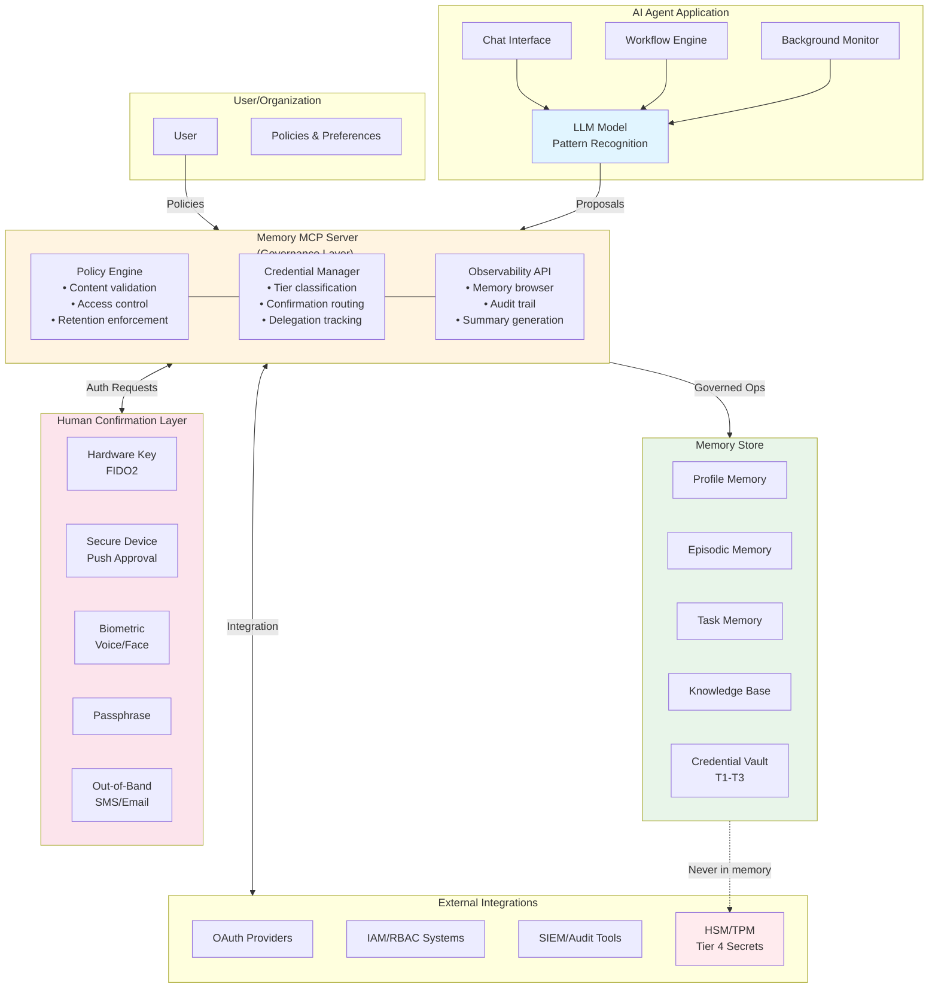
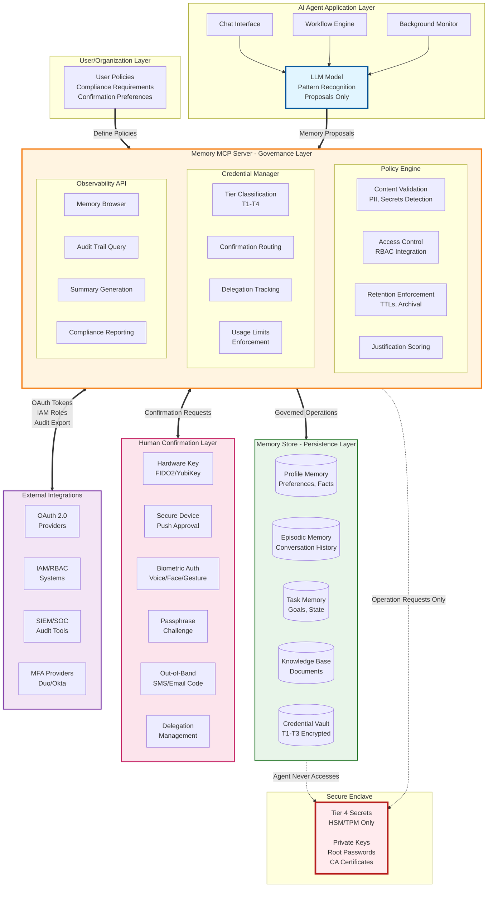

# Constitutional Memory: Governance Infrastructure for Persistent AI Agents

---

**Version**: 1.1  
**Date**: January 2026  
**Status**: Proposal for Industry Discussion

**What Changed in v1.1**: This revision addresses substantive critiques while preserving the original vision. Key changes: (1) explicit separation of normative requirements vs. recommended patterns vs. illustrative concepts, (2) biometrics reframed as one confirmation primitive among several, (3) stronger treatment of governance realism (failure modes, latency, cost), (4) explicit mapping to existing IAM/OAuth/HSM standards, (5) emphasis on incremental adoption. No core principles were removed; several were narrowed, scoped, or made more conservative.

---

## Abstract

As AI agents transition from stateless language models to persistent systems with delegated authority, **memory becomes governance-critical infrastructure**. Treating memory as an emergent property of prompts, embeddings, or logs produces ungoverned state that undermines security, compliance, reliability, and trust.

This paper proposes **constitutional memory**: a framework in which memory is a first-class, inspectable, and policy-governed subsystem, distinct from the language model itself. The framework separates pattern recognition (models) from authority, persistence, and enforcement (systems), enabling agents to operate with meaningful capability while remaining auditable, revocable, and compliant.

Constitutional memory is not a monolithic product or a mandate to replace existing standards. It is a **governance layer** that integrates with established identity, access management, cryptographic, and audit infrastructures. Its goal is to enable persistent, background-capable agents without creating opaque or uncontrollable state.

This proposal is designed for broad industry discussion and aims to establish interoperable standards that prevent ecosystem fragmentation while enabling innovation.

---

## Table of Contents

1. [Introduction](#1-introduction)
2. [The Memory Problem](#2-the-memory-problem)
3. [Core Principles (Normative)](#3-core-principles-normative)
4. [Architecture Overview](#4-architecture-overview)
5. [Credential Management](#5-credential-management)
6. [Multimodal Confirmation Patterns (Recommended)](#6-multimodal-confirmation-patterns-recommended)
7. [Technical Specification](#7-technical-specification)
8. [Integration with Existing Standards](#8-integration-with-existing-standards)
9. [Security, Compliance & Operational Reality](#9-security-compliance--operational-reality)
10. [Implementation Roadmap](#10-implementation-roadmap)
11. [Open Questions](#11-open-questions)
12. [Conclusion](#12-conclusion)

---

## 1. Introduction

### 1.1 Context

The AI landscape is undergoing a fundamental shift. Language models are evolving from stateless question-answering systems into persistent agents that:

- Remember user preferences and conversation history
- Maintain task state across sessions
- Access external systems on behalf of users
- Make autonomous decisions within delegated authority
- Operate continuously in background modes

This transition creates a critical infrastructure gap: **how do we govern agent memory in a way that is secure, compliant, auditable, and enables genuine capability?**

### 1.2 The Stakes

**Compliance**: Regulations like GDPR, CCPA, and industry-specific standards (HIPAA, PCI-DSS) require explainability, deletion rights, and secure credential storage.

**Security**: Ungoverned memory creates attack surfaces for prompt injection, credential theft, and persistent backdoors that survive across sessions.

**Capability**: Agents that cannot safely store credentials are limited to read-only tasks, unable to act as true digital representatives.

**Trust**: Users will not adopt agents they cannot inspect; organizations will not deploy systems they cannot audit.

**Fragmentation**: Without standards, every vendor builds proprietary memory systems, creating lock-in and incompatibility.

### 1.3 Scope and Non-Goals

This whitepaper:

1. **Analyzes** current memory approaches and their limitations
2. **Proposes** constitutional memory as a governance framework
3. **Specifies normative requirements** for safe persistent agents
4. **Recommends patterns** for credentials and confirmation
5. **Provides illustrative examples** for voice-first and multimodal interaction
6. **Identifies** open questions requiring community input

**This paper does NOT**:
- Define a new identity standard (integrates with existing IAM)
- Replace OAuth, FIDO2, HSMs, or SIEMs (builds on them)
- Assume universal biometric availability (offers multiple confirmation primitives)
- Mandate specific implementation details (defines interfaces and contracts)

This is a proposal for industry discussion, not a finalized standard.

---

## 2. The Memory Problem

### 2.1 Current Approaches

Modern AI agents employ various memory strategies:

**Vector Stores**: Embed past interactions and retrieve via similarity search. Effective for contextual recall but depends heavily on chunking strategy and retrieval quality.

**Structured Memory**: Maintain explicit schemas (user profiles, goals, constraints). Works well for predictable domains but requires careful design.

**Episodic Memory**: Store conversation snapshots with metadata (time, importance, sentiment). Provides narrative continuity but can grow unwieldy.

**Summarization**: Periodically compress interactions into rolling summaries. Efficient but risks losing nuance.

**Reinforcement Learning**: Update internal policies based on experience. Adaptive but opaque and hard to control.

**External Knowledge Bases**: Write to databases, wikis, or knowledge graphs. Persistent and queryable but lacks governance.

**Hybrid Architectures**: Combine multiple layers for comprehensive memory coverage.

### 2.2 The Fundamental Flaw

All current approaches share a critical weakness: **they assume the language model should manage memory**.

LLMs are pattern recognizers, not control systems. They cannot reliably:

- Detect what information is important to store
- Decide when retrieval is appropriate
- Maintain consistency across writes
- Enforce compliance policies
- Understand long-term continuity
- Safely manage credentials

**Asking models to orchestrate memory is like asking a search engine to manage your filesystem—the capabilities don't match the responsibility.**

### 2.3 Observed Failure Modes

Across current agent implementations, the same classes of failure recur:

**Under-retrieval**: Agent fails to recall relevant context, providing inconsistent responses.

**Over-retrieval**: Agent retrieves irrelevant memories, creating noise and degrading performance.

**Hallucinated Writes**: Agent "stores" information in a way that appears to work but doesn't persist.

**Missing Writes**: Critical information goes unrecorded because the model didn't recognize its importance.

**Inconsistent State**: Multiple writes create conflicting memories without resolution.

**Tool Misuse**: Model calls memory tools in incorrect formats or inappropriate contexts.

**Credential Exposure**: Sensitive tokens stored in unencrypted chat logs or vector databases.

**These failures are not model bugs. They are governance gaps.**

### 2.4 The Capability Gap

Beyond safety concerns, current approaches limit agent utility:

- **No Delegated Authority**: Agents can discuss but not execute
- **Manual Auth Every Time**: Users must re-authenticate for each action (unusable UX)
- **Read-Only by Default**: Agents remain glorified search interfaces
- **No Background Operation**: Can't monitor systems and act proactively

Users expect agents to "just handle it"—book flights, pay bills, manage infrastructure. This requires safe credential storage and delegation, which current memory approaches don't provide.

---

## 3. Core Principles (Normative)

The following principles are **non-optional** for constitutional memory. They define the minimum requirements for safe persistent agents.

### 3.1 Explicit, Not Emergent

Memory is a **first-class subsystem** with clear read/write semantics, not an accidental side effect of logs, caches, or model weights.

**Requirements**:
- Memory operations must be explicit API calls
- Memory types must be formally defined (profile, episodic, task, credentials, KB)
- Memory lifecycle must be governed (creation, access, expiration, deletion)

**No hidden persistence. No emergent behavior.**

### 3.2 Observable, Not Hidden

Every stored memory must be:

- **Inspectable**: Users can view what's stored
- **Queryable**: Search and filter by type, time, importance
- **Auditable**: Full history of who wrote what, when, and why
- **Deletable**: Users can remove specific memories or entire categories

**Full transparency. No unauditable state.**

### 3.3 Governed, Not Trusted

The model **proposes** memory operations; the system **enforces** policy.

**Requirements**:
- Rules, filters, and veto points between "LLM proposes X" and "X is persisted"
- Content validation (PII detection, redaction, rejection)
- Access control (who can read/write which memory types)
- Compliance enforcement (retention policies, consent requirements)
- Credential tiering (what requires human confirmation)

**The model is memory-literate; the system is memory-sovereign.**

### 3.4 Capability-Enabling, Not Just Protective

Governance exists to enable **safe capability**, not to eliminate capability entirely.

**Requirements**:
- Tiered credential management with human-in-the-loop confirmation
- Delegated authority within explicit bounds
- Audit trails that support capability, not just restriction

**Safety through governance, not limitation.**

---

## 4. Architecture Overview

### 4.1 Separation of Responsibilities (Normative)

| Layer | Responsibility | Normative Requirement |
|------|----------------|----------------------|
| **Model** | Pattern recognition, language, proposals | Must NOT enforce policy or exercise authority |
| **Memory Governance** | Policy enforcement, validation, routing | Must validate all operations against policy |
| **Persistence** | Durable storage, encryption | Must encrypt at rest, support lifecycle ops |
| **Authority Layer** | Identity, credentials, confirmation | Must enforce least-privilege access |
| **Human** | Final authority for sensitive actions | Must retain control over Tier 3+ credentials |

**This separation is normative. Implementation details are not.**

### 4.2 System Diagram



### 4.3 Failure and Degradation Modes (Normative)

A governed system must fail safely:

**If confirmation fails** → deny by default  
**If policy evaluation times out** → deny or degrade to read-only  
**If observability is unavailable** → restrict writes until restored  
**If credential tier cannot be determined** → treat as Tier 3 (require confirmation)

**Availability does not override authority.**

---

## 5. Credential Management

### 5.1 Normative Requirement

Persistent agents **must not** hold unrestricted credentials. Credential use must be:
- Scoped to specific actions
- Auditable with full logging
- Revocable at any time
- Time-limited where appropriate

### 5.2 Tiered Credential Model

Constitutional memory provides **four credential tiers** balancing capability with safety. **The tier determines the confirmation and execution path, not the UX.**

#### Tier 1: Public/Low-Risk Credentials

**Definition**: API keys for read-only public data, non-sensitive services

**Storage**: Encrypted at rest, standard memory governance

**Access**: Agent can use autonomously

**Examples**:
- Weather API key
- Public search API token
- Read-only database credentials

**Policy**:
- Store encrypted
- Audit all access
- Rotate regularly (e.g., every 90 days)

**Risk Level**: Low (limited blast radius if compromised)

---

#### Tier 2: Delegated Authority Credentials

**Definition**: OAuth tokens with specific scopes, time-limited access

**Storage**: Encrypted, scope-limited, with expiration

**Access**: Agent can use within scope boundaries

**Examples**:
- "Calendar read/write" OAuth token
- "Send email as user" permission
- "Read Slack messages" scope

**Policy**:
- Require explicit user grant (OAuth-style consent flow)
- Scope enforcement at memory layer
- Automatic expiration/refresh per OAuth standard
- Full audit trail of all uses

**Risk Level**: Medium (scoped to specific capabilities, time-limited)

---

#### Tier 3: Sensitive Credentials (Human-in-the-Loop)

**Definition**: Credentials enabling financial transactions, data deletion, security changes, admin operations

**Storage**: Encrypted with additional protection layer (separate key, secure enclave)

**Access**: **Requires real-time human confirmation via one of multiple primitives**

**Examples**:
- Payment card credentials
- Database admin passwords
- Production deployment keys

**Confirmation Primitives** (policy-selectable, not all required):
- **Hardware keys**: FIDO2/YubiKey physical confirmation
- **Secure device approval**: Push notification to trusted device
- **Biometric authentication**: Voice biometric or facial recognition (where appropriate)
- **Passphrase challenge**: User types or speaks specific phrase
- **Out-of-band confirmation**: SMS or email with unique code
- **Time-window delegation**: "Approve all X under $Y for next Z hours"

**Policy**:
- Confirmation method selected based on risk, context, and user preference
- Spending/action limits enforced at system level
- Full audit trail including confirmation proof
- Revocable at any time
- Supports graduated delegation

**Risk Level**: High (real financial/security impact if misused)

---

#### Tier 4: Cryptographic Secrets (Never in Memory)

**Definition**: Private keys, root passwords, HSM-protected secrets

**Storage**: **External secure enclave only** (HSM, TPM, OS keychain)

**Access**: Agent **never sees the secret**; requests operation, system performs in secure context

**Examples**:
- Code signing private keys
- Encryption private keys
- Root CA certificates

**Usage Pattern**:
```
Agent:  "I need to sign this release binary"
System: [Loads private key in HSM]
        [Signs binary in secure context]
        [Returns signature to agent]
        [Private key never leaves HSM]
```

**Policy**:
- Never enter agent memory under any circumstances
- Only operation result returned to agent
- May require multi-party approval (dual control)

**Risk Level**: Critical (catastrophic if leaked)

---

### 5.3 Justification Is Advisory, Not Authoritative (Normative)

Agent-provided justifications for credential use:
- Are treated as **signals**, not truth
- Are scored against context and history
- May trigger human review queues
- **Never serve as sole authorization**

The system never relies solely on the model's stated intent.

### 5.4 Credential Lifecycle

**Grant** → **Use** → **Rotate** → **Revoke** → **Audit**

Each phase has governance requirements (see Technical Specification for details).

---

## 6. Multimodal Confirmation Patterns (Recommended)

### 6.1 Status of This Section

**This section is illustrative and recommended, not normative.**

The core requirement is: **Tier 3+ credentials require human confirmation via policy-defined primitives.**

The specific UX patterns below are **recommendations** for voice-first and multimodal interfaces, designed for contexts where such interactions are appropriate.

### 6.2 Design Constraints (Normative)

Any confirmation UX must:
- Require explicit approval (no ambiguity)
- Resist spoofing and replay attacks
- Provide context proportional to risk
- Offer non-voice/non-biometric alternatives
- Support accessibility requirements

**Voice/biometrics are transports, not trust anchors.**

### 6.3 The Interface Shift (Context)

User interfaces are transitioning toward voice/gesture in specific contexts:

- Smart speakers and ambient devices
- AR/VR headsets with gaze and gesture input
- Automotive interfaces requiring hands-free operation
- Accessibility technologies for users with mobility impairments
- Wearables with limited screen space

**Implication**: Confirmation flows designed only for clicking buttons may become unusable in these contexts.

### 6.4 Voice Confirmation Pattern (Illustrative)

**Scenario**: High-stakes action in voice-first context

```
User:   "Book me a flight to Tokyo next week"
Agent:  [Searches flights]
        "I found United flight UA837 departing January 30.
         
         To book this, I need to charge $487 to your Visa ending in 4242.
         
         Say 'approve' to confirm, or 'show details' for more information."

User:   "Approve"
System: [Confirmation primitive: matches against enrolled voiceprint]
        [Context validation: request matches user's original ask]
        [Optional: Additional factor if policy requires]
Agent:  "Booking confirmed. Confirmation code JK7392."
```

**Key Properties**:
- Explicit approval phrase required
- Context-rich prompt
- Liveness/anti-replay checks in background
- Fallback to other primitives if voice unavailable

### 6.5 Multimodal Pattern: Voice + Visual (Illustrative)

For destructive actions, combine modalities:

```
User:   "Delete the production backup from last month"

Agent:  [Visual display]:
        ┌─────────────────────────────────────┐
        │ ⚠️  DESTRUCTIVE ACTION              │
        │                                     │
        │ Delete: prod_backup_2025-12        │
        │ Size: 47 GB                        │
        │                                     │
        │ This cannot be undone.             │
        │                                     │
        │ Say "confirm deletion" OR          │
        │ Use hardware key for approval      │
        └─────────────────────────────────────┘
        
Agent:  [Voice] "This is permanent. Say 'confirm deletion' or use your security key."

User:   [Option 1: Voice] "Confirm deletion"
        [Option 2: Hardware key] [Taps YubiKey]
        
System: [5-second countdown if voice; immediate if hardware key]
Agent:  "Backup deleted. Audit log created."
```

**Key Properties**:
- Multiple confirmation primitives offered
- Visual reinforcement for high-risk actions
- Explicit confirmation phrase (not just "yes")
- Hardware key as more secure alternative

### 6.6 Delegation Pattern (Recommended)

**Time-Windowed Delegation**:
```
User: "I'm booking travel today. Auto-approve flights under $2000."
Agent: "Understood. Until midnight, I can book flights up to $2000 
       without per-transaction confirmation.
       
       Each booking will be logged and you'll receive notifications.
       Say 'stop auto-approval' at any time to revoke."
```

**Emergency Revocation**:
```
User: "Stop! Cancel all agent access to my payment info"
System: [Immediate credential revocation]
Agent: "All payment credentials revoked. Delegation canceled."
```

---

## 7. Technical Specification

### 7.1 Memory MCP API

The Memory Model Context Protocol (Memory MCP) provides a standardized interface for constitutional memory operations.

[Technical specification continues as in v1.0, with additions:]

### 7.2 Confirmation Primitive API (New)

```typescript
interface ConfirmationRequest {
  session_id: string;
  tier: 3 | 4;
  action_context: ActionContext;
  available_primitives: ConfirmationPrimitive[];
  timeout: string;  // "60s"
}

type ConfirmationPrimitive = 
  | { type: "hardware_key"; protocols: ["FIDO2", "U2F"] }
  | { type: "secure_device"; push_target: string }
  | { type: "biometric_voice"; liveness_required: boolean }
  | { type: "biometric_face"; liveness_required: boolean }
  | { type: "passphrase"; complexity_requirements: string }
  | { type: "out_of_band"; channels: ["sms", "email"] }
  | { type: "gesture"; sensor_requirements: string };

interface ConfirmationResponse {
  status: "confirmed" | "denied" | "timeout" | "fallback_needed";
  primitive_used?: ConfirmationPrimitive;
  proof: ConfirmationProof;
  audit_id: string;
}

interface ConfirmationProof {
  method: string;
  timestamp: Date;
  challenge_hash?: string;  // For replay prevention
  device_id?: string;
  biometric_quality_score?: number;  // If biometric used
  context_validated: boolean;
}
```

### 7.3 Policy Definition Language (Enhanced)

```yaml
confirmation_policies:
  tier_3:
    default_primitive: "secure_device"  # Not hardcoded to biometric
    fallback_chain:
      - "hardware_key"
      - "biometric_voice"
      - "passphrase"
    
    context_upgrades:
      - condition: "amount > 5000"
        require: "hardware_key"
      - condition: "destructive_action == true"
        require_multi_factor: true
    
    liveness_detection:
      voice: true
      face: true
    
    replay_prevention:
      challenge_window: "30s"
      nonce_required: true
```

---

## 8. Integration with Existing Standards

### 8.1 Relationship to Existing Infrastructure (New Section)

Constitutional memory is a **governance layer**, not a replacement for existing standards.

| Constitutional Memory Component | Existing Standard/System | Integration Point |
|--------------------------------|-------------------------|-------------------|
| **Credential Vault T1-T2** | OAuth 2.0, OpenID Connect | Store and refresh OAuth tokens |
| **Credential Vault T3** | FIDO2, WebAuthn | Use as confirmation primitive |
| **Credential Vault T4** | HSM, TPM, Cloud KMS | Delegate to secure enclave |
| **Scope Enforcement** | IAM, RBAC systems | Map agent permissions to IAM roles |
| **Audit Trail** | SIEM, SOC tooling | Export events in standard formats |
| **Access Control** | LDAP, Active Directory | Integrate with org identity systems |
| **Confirmation** | MFA providers, Duo, Okta | Use as confirmation primitives |

### 8.2 Incremental Adoption Path

Organizations may adopt constitutional memory incrementally:

**Phase 1**: Observability only (add audit trails to existing memory)  
**Phase 2**: Policy enforcement (add content rules, TTLs)  
**Phase 3**: Credential vault T1-T2 (OAuth integration)  
**Phase 4**: Credential vault T3 (confirmation primitives)  
**Phase 5**: Full lifecycle management (archive, migrate, destroy)

**Full adoption is not required to gain value.**

---

## 9. Security, Compliance & Operational Reality

### 9.1 Cost Awareness (New)

Governance adds latency and cost. **This is intentional and necessary.**

Policies must allow optimization where safe:
- **Caching safe reads** (public profile data)
- **Batching audit writes** (reduce database load)
- **Configurable verbosity** (detailed vs. summary logging)
- **Tiered storage** (hot/warm/cold for different memory types)

**Security and compliance justify the overhead, but implementation should be efficient.**

### 9.2 Threat Model (Enhanced)

**Threat 1: Prompt Injection → Persistent Backdoor**

*Attack*: Adversary injects text causing agent to write malicious memory

*Mitigations*:
- Content validation (detect injection patterns)
- Justification scoring (not trusted as truth)
- Anomaly detection (unusual write patterns)
- Periodic user audits ("Review what I know about you")

**Threat 2: Credential Theft via Memory Dump**

*Attack*: Adversary gains access to memory storage and exfiltrates credentials

*Mitigations*:
- Tier-based encryption (separate keys per tier)
- Tier 4 never in memory (external HSM)
- Access logging (detect unauthorized reads)
- Key rotation policies

**Threat 3: Confirmation Spoofing**

*Attack*: Adversary uses recorded voice/photo or stolen device to fake confirmation

*Mitigations*:
- **Liveness detection** (challenge-response, movement detection)
- **Context validation** (does request match user behavior?)
- **Replay prevention** (nonce in challenge, timestamp validation)
- **Behavioral analysis** (typing cadence, request patterns)
- **Multi-factor for high-risk** (voice + device, face + hardware key)

**Threat 4: Delegation Abuse**

*Attack*: Agent exploits overly broad delegation

*Mitigations*:
- Limits enforced at system level (not model-dependent)
- Real-time notifications ("Agent spent $500")
- Anomaly detection (unusual patterns)
- Emergency revocation always available

**Threat 5: Cross-User Memory Leakage**

*Attack*: Multi-tenant agent accesses another user's memory

*Mitigations*:
- Cryptographic scope isolation
- Access control verification on every operation
- Tenant ID validation at multiple layers

**The primary risk remains: persistent, invisible state. Constitutional memory reduces risk by making state visible, bounded, and contestable.**

### 9.3 Compliance Mapping

**GDPR (General Data Protection Regulation)**:
- **Right to access**: Observability APIs (list, summarize, audit trail) allow users to see all stored data
- **Right to deletion**: Destroy operation with confirmation enables complete erasure
- **Right to portability**: Export memories in standard format for transfer to other systems
- **Data minimization**: TTLs, importance filtering, and policy-based pruning
- **Consent**: Explicit grants for memory types; users opt-in to storage
- **Purpose limitation**: Memory types enforce purpose (profile ≠ episodic ≠ credentials)
- **Accountability**: Full audit trails demonstrate compliance with processing requirements

**CCPA (California Consumer Privacy Act)**:
- **Transparency**: Full memory browsing capabilities show what's collected
- **Opt-out**: Users can disable specific memory types or all collection
- **Data sale prohibition**: Memories never shared without explicit consent; scopes enforce boundaries
- **Deletion rights**: Same as GDPR (destroy operation)
- **Non-discrimination**: Agent functionality gracefully degrades if user opts out

**PCI-DSS (Payment Card Industry Data Security Standard)**:
- **Secure storage**: Tier 3+ credentials encrypted with separate keys, hardware security modules
- **Access controls**: Role-based access to credential vault; principle of least privilege
- **Audit logging**: All credential usage logged with full context
- **Key rotation**: Automated rotation policies (Tier 1: 90 days, Tier 3: on-demand)
- **Encryption**: All memory types encrypted at rest; credentials use additional layers
- **No storage of sensitive auth data**: CVV, full PAN never stored; tokenization required
- **Quarterly audits**: Audit trail supports compliance reporting

**HIPAA (Health Insurance Portability and Accountability Act)**:
- **PHI protection**: Content rules automatically block medical data in non-compliant memory
- **Access controls**: Strict ACLs on health-related memories; role-based permissions
- **Audit trails**: Immutable logs of all access to PHI
- **Encryption**: All memory types encrypted at rest and in transit
- **Minimum necessary**: Importance scoring and TTLs enforce data minimization
- **Patient rights**: Users can access, export, and delete health-related memories
- **Business associate agreements**: Memory MCP server operators sign BAAs

**SOC 2 (Service Organization Control 2)**:
- **Security**: Tier-based credential management, encryption, access controls
- **Availability**: Archive/backup policies ensure data durability
- **Processing integrity**: Policy enforcement validation; justification scoring
- **Confidentiality**: Encryption at rest/in transit; scope isolation
- **Privacy**: User-controlled memory deletion; consent-based collection
- **Audit readiness**: Continuous logging supports SOC 2 audit requirements

---

## 10. Implementation Roadmap

### 10.1 Phase 1: Core Memory MCP

**Goals**:
- Define Memory MCP v1.0 specification
- Build reference implementation (open source)
- Support profile, episodic, task, KB memory types
- Implement basic policy engine (PII detection, TTLs)
- Create observability APIs (list, summarize, audit)

**Deliverables**:
- Memory MCP specification document
- Reference server implementation (Python/TypeScript)
- Client libraries (LangChain, AutoGen integration)
- Policy definition language v1
- Documentation and examples

**Success Criteria**:
- 3+ agent frameworks integrated
- 1000+ developers experimenting
- Baseline observability demonstrated

---

### 10.2 Phase 2: Credential Vault

**Goals**:
- Implement Tier 1-2 credential storage
- Add Tier 3 with **multiple confirmation primitives** (hardware key, secure device, biometric, passphrase)
- Build delegation management
- Create audit trail for credential usage
- Integrate with OAuth providers and FIDO2 systems

**Deliverables**:
- Credential vault extension to Memory MCP
- **Multi-primitive confirmation API specification**
- **Hardware key (FIDO2) integration**
- **Secure device approval flow**
- Voice/biometric authentication reference implementation
- Delegation policy engine
- Integration guides for payment/cloud/SaaS providers

**Success Criteria**:
- Tier 3 credentials usable in production
- **At least 3 confirmation primitives supported** (hardware key, secure device, one biometric)
- **Hardware key confirmation latency <1 second**
- Voice confirmation latency <2 seconds (if implemented)
- 10+ service integrations (Stripe, AWS, Google Workspace)

---

### 10.3 Phase 3: Voice-First UX

**Goals**:
- Design voice-native confirmation patterns
- Build multimodal prompts (voice + visual)
- Implement gesture confirmation (future-ready)
- Create ambient agent reporting framework
- Optimize for low-latency TTS integration

**Deliverables**:
- Voice UX pattern library
- Multimodal prompt composer
- Gesture confirmation API (for future use)
- Reference voice agent implementation
- TTS optimization guidelines

**Success Criteria**:
- Voice confirmation feels natural (user testing >80% satisfaction)
- Multimodal prompts reduce approval errors by 50%
- Gesture confirmation prototype functional

---

### 10.4 Phase 4: Enterprise & Compliance

**Goals**:
- Add role-based access controls (RBAC)
- Implement compliance preset policies (GDPR, HIPAA, PCI)
- Build enterprise audit dashboard
- Create compliance report generator
- Add federated identity support (SSO, SAML)

**Deliverables**:
- RBAC extension to Memory MCP
- Compliance policy templates
- Enterprise audit dashboard
- Compliance report generation tools
- SSO integration guides

**Success Criteria**:
- 3+ enterprise pilot deployments
- Pass external security audit
- Generate compliant audit reports for GDPR/HIPAA/PCI

---

### 10.5 Phase 5: Ecosystem Maturity

**Goals**:
- Establish Memory MCP as industry standard
- Build vendor-neutral consortium
- Create certification program
- Expand to new modalities (AR/VR, IoT)
- Drive academic research on memory governance

**Deliverables**:
- Memory MCP v2.0 with ecosystem feedback
- Certification program for MCP-compliant systems
- Research partnerships (universities, standards bodies)
- Extended protocol for AR/VR/IoT use cases

**Success Criteria**:
- 10+ major AI providers adopt Memory MCP
- 100+ certified implementations
- Industry-wide reduction in memory-related security incidents

---

## 11. Open Questions

### 11.1 Technical

**Q1**: Should memory encryption keys be per-user, per-agent, per-memory-type, or some combination?

**Q2**: What's the right balance between retrieval speed and storage cost for large memory systems?

**Q3**: How should conflicts be resolved when multiple agents propose contradictory memory writes?

**Q4 (New)**: What latency is acceptable for Tier 3 confirmations before users abandon the action?

**Q5 (New)**: Should justification quality scores affect confirmation requirements (high-confidence = lower friction)?

### 11.2 Policy & Governance

**Q6**: Who should be able to grant Tier 3 credentials to an agent—only the user, or also org admins?

**Q7**: Should there be industry-specific policy templates (healthcare, finance, government)?

**Q8 (New)**: How should "inherited delegation" work (e.g., EA approves on behalf of executive)?

**Q9 (New)**: What's the right approach for jurisdictions with data localization requirements?

### 11.3 User Experience

**Q11**: What's the right default for delegation duration—conservative (1 hour) or convenient (24 hours)?

**Q12 (New)**: Should voice confirmation require exact phrases ("approve") or accept natural variations?

**Q13**: How much detail should be in confirmation prompts—minimal (fast) or comprehensive (safe)?

**Q14 (New)**: What accessibility patterns are needed for users who cannot use common confirmation primitives?

### 11.4 Ecosystem

**Q16**: Should there be a public registry of Memory MCP servers for discoverability?

**Q17**: How should memory portability work across vendors (export format, migration tools)?

**Q18 (New)**: Should the Memory MCP spec be managed by a standards body (W3C, IETF) or independent foundation?

**Q19 (New)**: What minimum conformance testing is needed for "Memory MCP compliant" certification?

---

## 12. Conclusion

### 12.1 Summary

Constitutional memory addresses a critical infrastructure gap as AI agents transition from stateless tools to persistent systems with delegated authority.

**Key innovations**:
- **Normative separation** of model capabilities from governance enforcement
- **Tiered credential vault** with multiple confirmation primitives (not biometric-only)
- **Integration with existing standards** (OAuth, FIDO2, HSMs, IAM)
- **Incremental adoption path** (observability → policy → credentials → lifecycle)
- **Standardized Memory MCP** enabling ecosystem interoperability

**This is not a monolithic replacement. It is a governance layer that makes persistent agents safe, auditable, and capable.**

### 12.2 What This Framework Enables

With constitutional memory, agents can:
- Operate continuously without accumulating hidden state
- Act with real authority under explicit constraints
- Be audited, paused, forked, or destroyed safely
- Evolve without losing accountability
- **Move between platforms without vendor lock-in**

### 12.3 The Path Forward

This is a **proposal for industry collaboration**, not a finished standard.

We invite:
- **AI Providers**: Input on model-side memory capabilities
- **Tool Developers**: Feedback on practical APIs based on real use cases
- **Enterprise Users**: Compliance requirements and operational constraints
- **Security Experts**: Threat model review and mitigation proposals
- **Standards Bodies**: Guidance on formal standardization path

### 12.4 Final Thoughts

Memory is not a feature. **Memory is infrastructure.**

Without governance, persistent agents will either remain weak—or become dangerous.

This paper proposes a path that is:
- Architecturally conservative
- Governance-first
- Compatible with existing standards
- Incrementally adoptable
- Expandable as interfaces evolve

**The goal is not perfect safety. The goal is accountable capability.**

That is the minimum standard persistent agents must meet.

---

## Appendix A: Glossary

**Agent**: An AI system that can persist state across sessions and act autonomously within delegated authority

**Biometric Proof**: Cryptographic evidence of user confirmation via voice/face/gesture authentication (one of several confirmation primitives)

**Confirmation Primitive**: A method for human authorization (hardware key, biometric, passphrase, secure device approval, etc.)

**Constitutional Memory**: Memory governance framework based on explicit policies, observability, and human oversight

**Credential Vault**: Tiered secure storage for agent credentials (T1: low-risk, T2: delegated, T3: sensitive, T4: external-only)

**Delegation**: User-granted authority for agent to perform actions without per-action confirmation, within specified limits

**Episodic Memory**: Storage of conversation history and events with temporal metadata

**Governance Layer**: The policy enforcement, validation, and routing system that stands between model proposals and persistence

**Justification**: Agent-provided explanation for a proposed memory operation; treated as advisory signal, not authoritative proof

**Memory MCP**: Model Context Protocol extension providing standardized memory operations

**Normative Requirement**: A mandatory property that any implementation must satisfy to be considered constitutional memory

**Profile Memory**: Storage of user preferences, facts, and stable attributes

**Recommended Pattern**: A suggested approach that represents best practice but is not mandatory

**Task Memory**: Storage of current goals, workflow state, and short-term context

**Tier**: Classification of credential sensitivity determining required confirmation method (1-4)

---

## Appendix B: Comparison with Current Approaches

| Approach | Governance | Observability | Credentials | Standards Integration | Incremental Adoption | Status |
|----------|-----------|---------------|-------------|----------------------|---------------------|--------|
| **Vector stores alone** | None | None | Unsafe | None | N/A | Current default |
| **Tool-based memory** | Ad-hoc | Limited | Exposed | None | Possible | Emerging |
| **Fine-tuning** | None | None | N/A | None | N/A | Common |
| **OAuth per request** | External | None | Stateless | Full | Yes | Unusable UX |
| **Constitutional memory** | Explicit | Full | Tiered vault | Deep | Yes | **Proposed** |

Constitutional memory is not a replacement for these approaches—it's the **governance layer they all need** to become production-ready.

---

## Appendix C: Implementation Checklist

Organizations evaluating constitutional memory can use this checklist:

### Phase 1: Observability Foundation
- [ ] Memory operations logged to audit trail
- [ ] Users can view stored memories
- [ ] Search and filter capabilities available
- [ ] Export functionality for compliance

### Phase 2: Policy Enforcement
- [ ] PII detection and redaction rules active
- [ ] TTL policies defined per memory type
- [ ] Access controls enforced (read/write permissions)
- [ ] Content validation rules implemented

### Phase 3: Credential Vault (Tier 1-2)
- [ ] Encrypted storage for API keys
- [ ] OAuth token management
- [ ] Automatic token refresh
- [ ] Credential rotation policies

### Phase 4: Sensitive Credentials (Tier 3)
- [ ] Multiple confirmation primitives supported
- [ ] Hardware key integration (FIDO2)
- [ ] Secure device approval flow
- [ ] Delegation management system
- [ ] Emergency revocation capability

### Phase 5: Lifecycle Management
- [ ] Memory migration tools
- [ ] Archive policies and execution
- [ ] Secure destruction with audit preservation
- [ ] Schema versioning and upgrades

### Phase 6: Integration & Compliance
- [ ] IAM/RBAC integration
- [ ] SIEM export functionality
- [ ] Compliance report generation
- [ ] Multi-tenant isolation verified

---

## Appendix D: Reference Architecture Diagram



---

## Appendix E: Sample Policy Templates

### Template 1: Healthcare/HIPAA-Compliant Policy

```yaml
policy_version: "1.1"
scope: "org:healthcare_provider"
compliance_framework: "HIPAA"

content_rules:
  phi_detection:
    enabled: true
    actions:
      - type: "medical_record_number"
        action: "reject"  # Never store MRN
      - type: "diagnosis_code"
        action: "hash_with_salt"
      - type: "patient_name"
        action: "redact"
  
  audit_requirements:
    all_access_logged: true
    immutable_logs: true
    log_retention: "6years"

access_control:
  memory_types:
    patient_profile:
      read: ["role:physician", "role:nurse"]
      write: ["role:physician"]
      requires_mfa: true
    
credentials:
  tier_3:
    confirmation_methods: ["hardware_key", "secure_device"]
    multi_factor_required: true
    no_delegation: true  # Healthcare: no time-windowed approval

retention:
  patient_data:
    ttl: "6years"  # HIPAA requirement
    archive_after: "2years"
    secure_destruction: true
```

### Template 2: Financial Services/PCI-DSS Policy

```yaml
policy_version: "1.1"
scope: "org:financial_services"
compliance_framework: "PCI-DSS"

content_rules:
  pci_detection:
    enabled: true
    actions:
      - type: "credit_card_number"
        action: "reject"  # Never store full PAN
      - type: "cvv"
        action: "reject"  # Never store CVV
      - type: "tokenized_card"
        action: "encrypt_tier_3"

credentials:
  tier_3:
    confirmation_methods: ["hardware_key"]  # Strongest only
    spending_limits:
      per_transaction: 10000
      per_day: 50000
    require_dual_approval_above: 100000

  rotation:
    tier_1: "30days"
    tier_2: "30days"
    tier_3: "on_each_use"  # No persistent storage

audit:
  real_time_monitoring: true
  anomaly_detection:
    enabled: true
    alert_on:
      - unusual_spending_pattern
      - velocity_check_failure
      - geographic_anomaly
```

### Template 3: Developer/Low-Security Policy

```yaml
policy_version: "1.1"
scope: "user:developer"
compliance_framework: "none"

content_rules:
  pii_detection:
    enabled: true
    actions:
      - type: "email"
        action: "hash"
      - type: "api_key"
        action: "reject"  # Still no raw secrets

credentials:
  tier_2:
    auto_approve: true  # Calendar, email, etc.
  
  tier_3:
    confirmation_methods: ["passphrase", "secure_device"]
    spending_limits:
      default: 500
      cloud_infrastructure: 1000
    delegation:
      max_duration: "24hours"
      auto_renew: true

retention:
  profile: "1year"
  episodic: "90days"
  task: "7days"
```

---

## Appendix F: Migration Guide from Existing Systems

### Migrating from RAG + Vector Store

**Current state**: Unstructured embeddings in vector DB, no policy layer

**Migration path**:
1. **Audit existing storage**: Inventory what's in vector store
2. **Add Memory MCP wrapper**: Route all writes through governance layer
3. **Classify memories**: Tag as profile/episodic/task/KB
4. **Apply policies**: Add PII detection, TTLs
5. **Enable observability**: Allow users to browse/delete

**Timeline**: 2-4 weeks for basic governance

### Migrating from Tool-Based Memory

**Current state**: Agent calls `save_memory(key, value)` tool directly

**Migration path**:
1. **Replace tool backend**: Point to Memory MCP server
2. **Add justification**: Require agent to explain why storing
3. **Enable policy checks**: Validate before persistence
4. **Add audit logging**: Track all memory operations
5. **User review**: Periodic "what does agent know about me?"

**Timeline**: 1-2 weeks for tool swap + policy setup

### Migrating from Fine-Tuning Approach

**Current state**: User data baked into model weights

**Migration path**:
1. **Extract knowledge**: Pull facts from fine-tuned model
2. **Restructure as memories**: Convert to profile/episodic format
3. **Store in Memory MCP**: With proper governance
4. **Revert to base model**: Use retrieval instead of tuning
5. **Gradual transition**: Phase out fine-tuned model

**Timeline**: 4-8 weeks (complex migration)

---

## Appendix G: Frequently Asked Questions

**Q: Does constitutional memory require replacing our entire agent stack?**

A: No. It's a governance layer that wraps existing memory systems. You can integrate incrementally.

**Q: Is biometric authentication mandatory?**

A: No. Biometrics are one of several confirmation primitives. Hardware keys, secure device approval, and passphrases are equally valid.

**Q: What if users don't want agents storing anything?**

A: Users can disable memory entirely, or enable only specific types (e.g., task memory but not episodic).

**Q: How does this work with existing OAuth flows?**

A: Constitutional memory stores OAuth tokens as Tier 2 credentials, respecting original scopes and expiration.

**Q: What about open-source / self-hosted deployments?**

A: The Memory MCP spec is designed to be implementable by anyone. Reference implementations will be open source.

**Q: Does this add latency to every agent interaction?**

A: Policy checks add minimal latency (<50ms typically). Confirmation flows only trigger for Tier 3+ credentials.

**Q: Can agents operate offline?**

A: Read-only operations can work offline with cached memories. Writes and Tier 3 credentials require connectivity.

**Q: How do I know if my Memory MCP implementation is compliant?**

A: Conformance testing suite will be published as part of Phase 5 (see roadmap).

**Q: What happens if the governance layer fails?**

A: System degrades gracefully: deny by default, restrict to read-only, or pause until governance restored (policy-configurable).

**Q: Is this only for commercial AI providers?**

A: No. Any agent system—commercial, open source, research, personal—can benefit from constitutional memory.

---

## Appendix H: Related Work & Standards

**Identity & Access Management**:
- OAuth 2.0 (RFC 6749)
- OpenID Connect
- SAML 2.0
- RBAC (NIST RBAC model)

**Authentication & Confirmation**:
- FIDO2 / WebAuthn (W3C)
- TOTP (RFC 6238)
- U2F (Universal 2nd Factor)

**Cryptographic Storage**:
- PKCS#11 (Cryptographic Token Interface)
- TPM 2.0 Specification
- Cloud KMS standards (AWS, GCP, Azure)

**Audit & Compliance**:
- Common Event Format (CEF)
- Syslog (RFC 5424)
- OWASP Logging Cheat Sheet
- SOC 2 Trust Service Criteria

**Privacy Regulations**:
- GDPR (EU)
- CCPA (California)
- HIPAA (US Healthcare)
- PCI-DSS (Payment Cards)

**AI Governance (Emerging)**:
- EU AI Act
- NIST AI Risk Management Framework
- ISO/IEC 23894 (AI Risk Management)

---

*This document is released for industry discussion and feedback. The authors welcome critique, alternative proposals, and collaborative refinement. The goal is not to impose a single solution, but to establish shared principles that enable safe, capable, and trustworthy persistent AI agents.*
