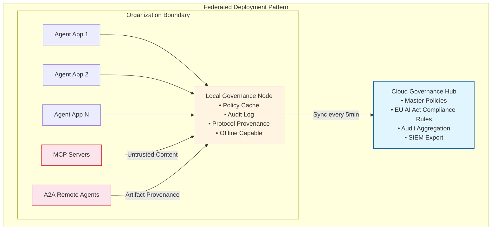
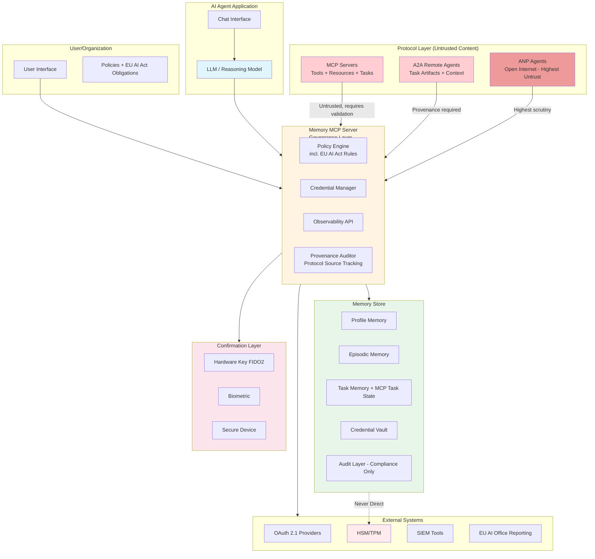
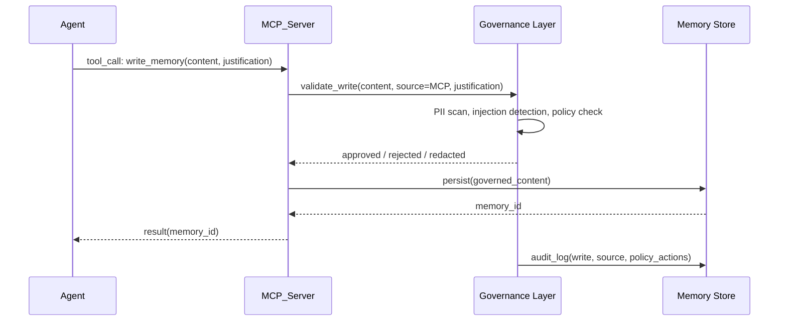
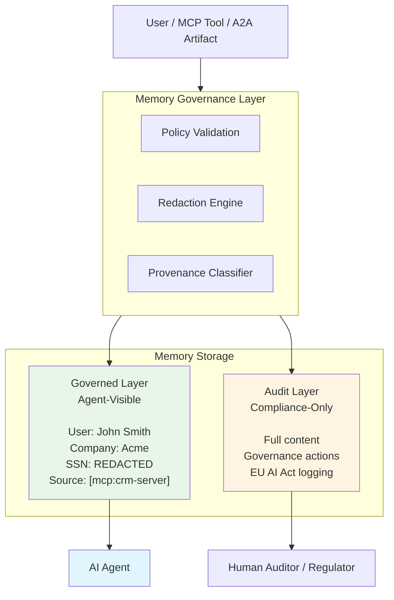

# Constitutional Memory: Governance Infrastructure for Persistent AI Agents

> **Version 2.1 — July 2026**
> Updated for the **Digital Omnibus on AI** (Council final approval 29 June 2026, redrawing the EU AI Act high-risk timeline) and the **MCP 2026-07-28 specification** (release candidate: stateless protocol core, Tasks as an official extension, MCP Apps, hardened authorization; final spec due 28 July 2026). Retains the v2.0 coverage of the MCP November 2025 specification, A2A/ACP protocol convergence under the Linux Foundation, reasoning model threat surface, multi-agent memory isolation requirements, and production-scale operational realities.

---

## Abstract

As AI agents transition from stateless language models to persistent systems with delegated authority, **memory becomes governance-critical infrastructure**. Treating memory as an emergent property of prompts, embeddings, or logs produces ungoverned state that undermines security, compliance, reliability, and trust.

This document proposes **constitutional memory**: a framework in which memory is a first-class, inspectable, and policy-governed subsystem, distinct from the language model itself. The framework separates pattern recognition (models) from authority, persistence, and enforcement (systems), enabling agents to operate with meaningful capability while remaining auditable, revocable, and compliant.

Constitutional memory is not a monolithic product or a mandate to replace existing standards. It is a **governance layer** that integrates with established identity, access management, cryptographic, and audit infrastructures — including the now-mature MCP (Model Context Protocol), A2A (Agent-to-Agent Protocol), and emerging ANP (Agent Network Protocol) ecosystems. Its goal is to enable persistent, background-capable agents without creating opaque or uncontrollable state.

**As of mid-2026, the protocol ecosystem has fundamentally shifted.** MCP has been donated to the Linux Foundation's Agentic AI Foundation (AAIF) with Anthropic, Google, Microsoft, AWS, OpenAI, and Block as platinum members. A2A — launched by Google in April 2025 and now also under the Linux Foundation — defines how agents communicate with each other, while MCP governs how agents communicate with tools. IBM's ACP merged into A2A in August 2025. The EU AI Act's Article 50 transparency obligations apply from 2 August 2026, while the Digital Omnibus on AI (adopted June 2026) defers the stand-alone high-risk obligations to 2 December 2027. Constitutional memory must now be positioned within this mature, standards-governed landscape.

---

## Table of Contents

1. [Introduction](#1-introduction)
2. [The 2026 Landscape](#2-the-2026-landscape)
3. [The Memory Problem](#3-the-memory-problem)
4. [Core Principles](#4-core-principles)
5. [Architecture Overview](#5-architecture-overview)
6. [Protocol Integration: MCP, A2A, ANP](#6-protocol-integration-mcp-a2a-anp)
7. [Credential Management](#7-credential-management)
8. [Multimodal Confirmation Patterns](#8-multimodal-confirmation-patterns)
9. [Technical Specification](#9-technical-specification)
10. [Integration with Existing Standards](#10-integration-with-existing-standards)
11. [Security & Compliance](#11-security--compliance)
12. [Regulatory Alignment: EU AI Act & GDPR](#12-regulatory-alignment-eu-ai-act--gdpr)
13. [Reasoning Model Considerations](#13-reasoning-model-considerations)
14. [Memory Coherence & Transparency](#14-memory-coherence--transparency)
15. [Performance & Operational Reality](#15-performance--operational-reality)
16. [Implementation Approach](#16-implementation-approach)
17. [Open Questions](#17-open-questions)
18. [Conclusion](#18-conclusion)

---

## 1. Introduction

### 1.1 Context

The AI landscape as of mid-2026 has undergone a fundamental shift. Language models are no longer experimental tools — they are deployed in production agentic systems that:

- Remember user preferences and conversation history across sessions
- Maintain task state and delegate sub-tasks to specialized agents
- Access external systems on behalf of users via standardized protocols (MCP, A2A)
- Make autonomous decisions within delegated authority, often across organizational boundaries
- Operate continuously in background modes with minimal human oversight

Multi-agent architectures are now the norm, not the exception. A single user action may trigger an orchestrator agent that spawns sub-agents, each communicating via A2A, each accessing tools via MCP, each maintaining their own memory context. **This is no longer a future concern — it is the current production reality.**

This transition creates a critical infrastructure gap that has only deepened: **how do we govern agent memory across heterogeneous, multi-agent, multi-protocol deployments in a way that is secure, compliant, auditable, and enables genuine capability?**

### 1.2 The Stakes in 2026

**Compliance (restructured, not relaxed)**: The Digital Omnibus on AI — given final Council approval on 29 June 2026 — defers the EU AI Act's stand-alone high-risk (Annex III) obligations to **2 December 2027** (product-embedded Annex I systems: 2 August 2028). But the **Article 50 transparency obligations still apply from 2 August 2026**, machine-readable watermarking for legacy systems follows on 2 December 2026, and a new prohibition on AI generating non-consensual intimate imagery or CSAM takes effect the same day. GPAI model obligations and penalty enforcement began August 2025; fines reach €35M or 7% of global annual turnover for prohibited practices. The deferral is paired with a high-risk registration mechanism and expanded AI Office inspection powers — the clock is structured, not paused. Persistent agents with ungoverned memory are directly implicated in transparency, human oversight, and post-market monitoring obligations.

**Security (escalating)**: Documented real-world exploits now include zero-click RCE via MCP-based IDEs (CVE-2025-59944), EchoLeak (CVE-2025-32711) via Microsoft Copilot email injection, GitHub Copilot RCE (CVE-2025-53773), and Log-To-Leak attacks targeting MCP tool invocation chains. Ungoverned memory is no longer a theoretical attack surface.

**Capability (expanding)**: Agents using current-generation reasoning models (the Claude 5 family and Claude Opus 4.x, GPT-5-class models, Gemini 3, DeepSeek's latest releases) plan multi-step operations more effectively than prior generations. This amplifies both their capability and the blast radius of memory compromise.

**Fragmentation (crystallizing)**: The protocol landscape has converged. MCP governs tool integration. A2A governs agent-to-agent delegation. ANP governs open-internet agent discovery via DIDs. Memory governance must operate coherently across all three layers.

**Trust (non-negotiable)**: With 85% of enterprises expected to deploy AI agents by end of 2025, governance infrastructure is becoming a procurement requirement, not a differentiator.

### 1.3 Scope and Non-Goals

This document:

1. **Analyzes** current memory approaches and their limitations
2. **Proposes** constitutional memory as a governance framework updated for the 2026 protocol landscape
3. **Specifies normative requirements** for safe persistent agents
4. **Recommends patterns** for credentials and confirmation
5. **Maps obligations** to the EU AI Act enforcement timeline
6. **Addresses reasoning model threat surface** as a new attack category
7. **Defines multi-agent memory isolation** requirements for A2A/MCP deployments
8. **Identifies** open questions requiring community input

**This document does NOT**:
- Define a new identity standard (integrates with existing IAM)
- Replace OAuth 2.1, FIDO2, HSMs, or SIEMs (builds on them)
- Replace MCP, A2A, or ANP (operates as their governance layer)
- Mandate specific implementation details (defines interfaces and contracts)

---

## 2. The 2026 Landscape

### 2.1 Protocol Ecosystem Convergence

The agent protocol landscape has stabilized around three complementary standards, all now under Linux Foundation governance:

| Protocol | Governs | Origin | Status (July 2026) |
|----------|---------|--------|---------------------|
| **MCP** (Model Context Protocol) | Agent ↔ Tool communication | Anthropic, Nov 2024 | Donated to AAIF/Linux Foundation, Dec 2025. Current spec: Nov 2025; **2026-07-28 release candidate published** (stateless core, Tasks as an extension, MCP Apps), final spec 28 July 2026. OAuth 2.1 + RFC 8707 Resource Indicators mandatory; 2026-07-28 adds protocol-level token audience binding. |
| **A2A** (Agent-to-Agent Protocol) | Agent ↔ Agent communication | Google, April 2025 | Linux Foundation, June 2025. v0.3+ with gRPC, signed Agent Cards. ACP merged in August 2025. 150+ org supporters. |
| **ANP** (Agent Network Protocol) | Open-internet agent discovery | Community | DID-based (did:wba), decentralized identity, peer-to-peer discovery. Early adoption. |

**MCP November 2025 specification** introduced the Tasks primitive, enabling asynchronous long-running operations — shifting MCP from a call-and-response interface to a workflow orchestration layer. This has profound memory implications: tasks now have lifecycle state that must be governed.

**MCP 2026-07-28** — the largest revision since MCP launched, with the final specification due 28 July 2026 (release candidate published) — makes the protocol core **stateless**: the initialize handshake and the `Mcp-Session-Id` header are removed, and protocol version, client info, and capabilities travel in `_meta` on every request. Tasks moves out of the core into an official **extension** with a polling lifecycle, joined by an Extensions framework, MCP Apps (server-declared, sandboxed interactive UIs), hardened authorization (protocol-level token audience binding), and a formal deprecation policy. For memory governance this is a net gain: fully self-contained requests are simpler to audit, attribute, and route through policy at a gateway (see [Section 6.1](#61-mcp-as-memory-transport)).

**A2A** uses Agent Cards (JSON capability advertisements discoverable via `.well-known` URLs) and supports OAuth 2.0/OIDC for authentication. Sensitive data may traverse intermediate agents in multi-hop A2A chains. Memory governance must account for cross-agent context propagation.

**Constitutional memory is the governance layer that all three protocols require but none provide.**

### 2.2 Reasoning Model Era

The deployment of reasoning models at scale (as of mid-2026: the Claude 5 family and Claude Opus 4.x, GPT-5-class models, Gemini 3, DeepSeek's latest releases) changes the memory threat landscape in two directions simultaneously:

**Amplified capability**: Reasoning models can execute complex multi-step plans, making long-running agents significantly more powerful and useful. Memory governance must support, not obstruct, this capability.

**Amplified threat surface**: The same multi-step planning ability makes reasoning models more effective at crafting prompt injection payloads, systematically poisoning memory over extended interactions, and exploiting governance gaps across tool-call chains. A reasoning model adversary is not a single-shot attacker — it is a planner.

This is addressed in detail in [Section 13](#13-reasoning-model-considerations).

### 2.3 Regulatory Inflection Point

| Date | EU AI Act Milestone (as amended by the Digital Omnibus on AI, June 2026) |
|------|---------------------|
| Feb 2, 2025 | Prohibited AI practices banned. AI literacy obligations active. |
| Aug 2, 2025 | GPAI model obligations active. Penalty regime operational. AI Office fully operational. Fines up to €35M / 7% turnover. |
| **Aug 2, 2026** | **Article 50 transparency obligations apply — not deferred by the Omnibus. National enforcement structures active.** |
| **Dec 2, 2026** | **Machine-readable watermarking (Art. 50(2)) applies to systems placed on the market before Aug 2, 2026 (new systems must mark from Aug 2, 2026). New prohibition: AI generating non-consensual intimate imagery / CSAM.** |
| **Dec 2, 2027** | **Stand-alone high-risk AI systems (Annex III), including Art. 14 human oversight. Deferred from Aug 2, 2026.** |
| Aug 2, 2028 | High-risk AI embedded in regulated products (Annex I). Deferred from Aug 2, 2027. |

The Digital Omnibus on AI (provisional agreement 7 May 2026; Parliament endorsement 16 June; Council final approval 29 June 2026; Official Journal publication expected July 2026) redrew this timeline — but paired the deferral with a high-risk registration database and expanded AI Office investigatory powers, including on-site inspections. The clock is structured, not paused. Persistent AI agents with delegated authority over financial, personal, or organizational data are directly implicated in the August 2026 transparency obligations and the December 2027 high-risk obligations. Constitutional memory provides the audit trail, human oversight, and data governance infrastructure these obligations require.

---

## 3. The Memory Problem

### 3.1 Current Approaches

Modern AI agents employ various memory strategies:

**Vector Stores**: Embed past interactions and retrieve via similarity search. Effective for contextual recall but depends heavily on chunking strategy and retrieval quality. No governance layer.

**Structured Memory**: Maintain explicit schemas (user profiles, goals, constraints). Works well for predictable domains but requires careful design and has no lifecycle management.

**Episodic Memory**: Store conversation snapshots with metadata (time, importance, sentiment). Provides narrative continuity but can grow unwieldy and lacks retention policies.

**Summarization**: Periodically compress interactions into rolling summaries. Efficient but risks losing nuance and compliance-relevant detail.

**External Knowledge Bases**: Write to databases, wikis, or knowledge graphs. Persistent and queryable but lacks governance.

**MCP Resource/Tool Memory**: Use MCP server resources as persistent state. Standardized interface but governance is left to implementors.

**A2A Context Propagation**: Pass memory context between agents in A2A task artifacts. No standard governance at the inter-agent boundary.

**Hybrid Architectures**: Combine multiple layers. Common in production but governance complexity compounds with each layer.

### 3.2 The Fundamental Flaw

All current approaches share a critical weakness: **they assume the language model should manage memory, or that protocol adoption alone is sufficient governance.**

MCP defines *how* to call a memory tool. A2A defines *how* agents share task context. Neither defines *what policies govern what gets stored, who can read it, how long it persists, when it must be deleted, or what confirmation is required before sensitive data is acted upon.*

LLMs are pattern recognizers, not control systems. They cannot reliably:
- Detect what information is important to store
- Decide when retrieval is appropriate
- Maintain consistency across writes
- Enforce compliance policies
- Safely manage credentials
- Evaluate the trustworthiness of content arriving via A2A or MCP tool responses

**Adopting MCP or A2A without a governance layer is like wiring your house to the internet without a firewall.**

### 3.3 Observed Failure Modes

Across current agent implementations, the same classes of failure recur:

**Under-retrieval**: Agent fails to recall relevant context, providing inconsistent responses.

**Over-retrieval**: Agent retrieves irrelevant memories, creating noise and degrading performance.

**Hallucinated Writes**: Agent "stores" information in a way that appears to work but doesn't persist.

**Missing Writes**: Critical information goes unrecorded because the model didn't recognize its importance.

**Inconsistent State**: Multiple writes — especially across A2A agent hops — create conflicting memories without resolution.

**Cross-Agent Context Leakage**: Memory context flows via A2A task artifacts to agents that should not have access.

**Tool Chain Injection**: Malicious content in an MCP tool response rewrites memory (Log-To-Leak pattern, documented in production).

**Credential Exposure**: Sensitive tokens stored in unencrypted chat logs, vector databases, or A2A task artifacts.

**These failures are not model bugs. They are governance gaps.**

### 3.4 The Capability Gap

Beyond safety concerns, current approaches limit agent utility:

- **No Delegated Authority**: Agents can discuss but not execute
- **Manual Auth Every Time**: Users must re-authenticate for each action (unusable UX)
- **No Background Operation**: Can't monitor systems and act proactively
- **No Safe Multi-Agent Delegation**: Passing authority through A2A chains without provenance

Users expect agents to "just handle it" across the entire MCP+A2A ecosystem. This requires safe credential storage, delegation, and memory governance at every layer.

---

## 4. Core Principles

The following principles define the minimum requirements for constitutional memory. They are **non-optional** for safe persistent agents.

### 4.1 Explicit, Not Emergent

Memory is a **first-class subsystem** with clear read/write semantics, not an accidental side effect of logs, caches, model weights, MCP resource writes, or A2A task artifacts.

**Requirements**:
- Memory operations must be explicit API calls
- Memory types must be formally defined (profile, episodic, task, credentials, knowledge base)
- Memory lifecycle must be governed (creation, access, expiration, deletion)
- MCP Task state and A2A artifact context must be subject to the same governance as direct writes

### 4.2 Observable, Not Hidden

Every stored memory must be:

- **Inspectable**: Users can view what's stored
- **Queryable**: Search and filter by type, time, importance
- **Auditable**: Full history of who wrote what, when, why, and via which protocol layer
- **Deletable**: Users can remove specific memories or entire categories

### 4.3 Governed, Not Trusted

The model **proposes** memory operations; the system **enforces** policy. **Content arriving via MCP tool responses or A2A task artifacts is untrusted data — not trusted input.**

**Requirements**:
- Rules, filters, and veto points between "LLM/agent proposes X" and "X is persisted"
- Content validation (PII detection, injection pattern detection, redaction, rejection)
- Access control (who can read/write which memory types, including cross-agent boundaries)
- Compliance enforcement (retention policies, consent requirements, EU AI Act obligations)
- Credential tiering (what requires human confirmation)
- Protocol-layer attribution (which MCP server / A2A agent was the source)

### 4.4 Capability-Enabling, Not Just Protective

Governance exists to enable **safe capability**, not to eliminate capability entirely.

**Requirements**:
- Tiered credential management with human-in-the-loop confirmation
- Delegated authority within explicit bounds across A2A agent chains
- Reasoning model support — governance must not create latency that makes planning loops infeasible
- Audit trails that support capability, not just restriction

### 4.5 Distributed, Not Centralized

Governance must not create single points of failure, especially in multi-agent deployments.

**Requirements**:
- Multiple governance deployment patterns (centralized, federated, distributed)
- Graceful degradation when governance layers are unavailable
- Policy caching and offline operation capabilities
- Health monitoring and circuit breakers
- Per-agent governance namespace isolation in multi-tenant deployments

### 4.6 Protocol-Aware, Not Protocol-Agnostic

Memory governance must understand the semantics of the protocol layer through which content arrives.

**Requirements**:
- MCP tool responses are untrusted external content by default
- A2A task artifacts carry source agent provenance and must be validated before memory writes
- ANP-sourced content from open-internet agents carries highest untrust classification
- Protocol-layer provenance must be part of the governance audit trail

---

## 5. Architecture Overview

### 5.1 Separation of Responsibilities

| Layer | Responsibility | Normative Requirement |
|-------|----------------|----------------------|
| **Model** | Pattern recognition, language, proposals | Must NOT enforce policy or exercise authority |
| **Protocol Layer** | MCP tool calls, A2A task delegation, ANP discovery | Must NOT be treated as trusted input for memory writes |
| **Memory Governance** | Policy enforcement, validation, routing, provenance tracking | Must validate all operations against policy; must track source protocol |
| **Persistence** | Durable storage, encryption | Must encrypt at rest, support lifecycle ops |
| **Authority Layer** | Identity, credentials, confirmation | Must enforce least-privilege access |
| **Human** | Final authority for sensitive actions | Must retain control over Tier 3+ credentials |

### 5.2 Governance Deployment Patterns

Constitutional memory supports multiple deployment architectures:

**Centralized**: Single governance server (simple, suitable for development)
**Federated**: Local governance nodes with cloud synchronization (enterprise deployments — recommended)
**Distributed**: Full consensus-based mesh (critical infrastructure)

Organizations choose the pattern that matches their scale and requirements.


```mermaid
graph TB
    subgraph "Federated Deployment Pattern"
        subgraph Org["Organization Boundary"]
            App1[Agent App 1]
            App2[Agent App 2]
            App3[Agent App N]
            MCP1[MCP Servers]
            A2A1[A2A Remote Agents]
            LocalGov["Local Governance Node<br/>• Policy Cache<br/>• Audit Log<br/>• Protocol Provenance<br/>• Offline Capable"]
        end
        
        Cloud["Cloud Governance Hub<br/>• Master Policies<br/>• EU AI Act Compliance Rules<br/>• Audit Aggregation<br/>• SIEM Export"]
        
        App1 --> LocalGov
        App2 --> LocalGov
        App3 --> LocalGov
        MCP1 -->|Untrusted Content| LocalGov
        A2A1 -->|Artifact Provenance| LocalGov
        LocalGov -->|Sync every 5min| Cloud
    end
    
    style LocalGov fill:#fff4e1,stroke:#f57f17
    style Cloud fill:#e1f5ff,stroke:#01579b
    style MCP1 fill:#fce4ec,stroke:#c62828
    style A2A1 fill:#fce4ec,stroke:#c62828
```

### 5.3 System Architecture


```mermaid
graph TB
    subgraph User["User/Organization"]
        U[User Interface]
        P[Policies + EU AI Act Obligations]
    end
    
    subgraph Agent["AI Agent Application"]
        Chat[Chat Interface]
        LLM[LLM / Reasoning Model]
    end
    
    subgraph Protocols["Protocol Layer (Untrusted Content)"]
        MCP[MCP Servers<br/>Tools + Resources + Tasks]
        A2A[A2A Remote Agents<br/>Task Artifacts + Context]
        ANP[ANP Agents<br/>Open Internet - Highest Untrust]
    end
    
    subgraph MCP_Gov["Memory MCP Server<br/>Governance Layer"]
        PE[Policy Engine<br/>incl. EU AI Act Rules]
        CM[Credential Manager]
        OA[Observability API]
        PA[Provenance Auditor<br/>Protocol Source Tracking]
    end
    
    subgraph Storage["Memory Store"]
        Prof[Profile Memory]
        Epis[Episodic Memory]
        Task[Task Memory + MCP Task State]
        Vault[Credential Vault]
        Audit[Audit Layer - Compliance Only]
    end
    
    subgraph Confirm["Confirmation Layer"]
        HWK[Hardware Key FIDO2]
        Bio[Biometric]
        Dev[Secure Device]
    end
    
    subgraph External["External Systems"]
        OAuth[OAuth 2.1 Providers]
        HSM[HSM/TPM]
        SIEM[SIEM Tools]
        EUAIOff[EU AI Office Reporting]
    end
    
    U --> MCP_Gov
    Chat --> LLM
    LLM --> MCP_Gov
    MCP -->|Untrusted, requires validation| MCP_Gov
    A2A -->|Provenance required| MCP_Gov
    ANP -->|Highest scrutiny| MCP_Gov
    MCP_Gov --> Storage
    MCP_Gov --> Confirm
    MCP_Gov --> External
    Storage -.->|Never Direct| HSM
    
    style LLM fill:#e1f5ff
    style MCP_Gov fill:#fff4e1
    style Storage fill:#e8f5e9
    style Confirm fill:#fce4ec
    style HSM fill:#ffebee
    style MCP fill:#ffcdd2
    style A2A fill:#ffcdd2
    style ANP fill:#ef9a9a
```

### 5.4 Failure and Degradation Modes

A governed system must fail safely:

**If confirmation fails** → deny by default  
**If policy evaluation times out** → deny or degrade to read-only  
**If observability is unavailable** → restrict writes until restored  
**If credential tier cannot be determined** → treat as Tier 3 (require confirmation)  
**If governance layer unreachable** → use cached policies, then degrade to read-only  
**If protocol provenance is absent** → treat as highest-untrust source, reject memory writes  
**If A2A agent card signature cannot be verified** → treat artifact as untrusted external content  

```yaml
failure_modes:
  governance_unreachable:
    immediate: use_cached_policies
    after_timeout: degrade_to_read_only
    
  policy_conflict:
    resolution: most_restrictive_wins
    audit_log: true
    
  cache_stale:
    max_age: 1h
    stale_while_revalidate: true
  
  missing_provenance:
    protocol_source_unknown: reject_write
    audit: always
  
  a2a_card_unverifiable:
    action: reject_artifact_memory_write
    allow: read_only_context_for_current_turn
```

---

## 6. Protocol Integration: MCP, A2A, ANP

### 6.1 MCP as Memory Transport

MCP (November 2025 spec, with the 2026-07-28 revision finalizing as of this writing) is the primary mechanism by which agents invoke memory operations. **Constitutional memory is the governance layer that runs beneath the MCP interface.**

Key MCP concepts relevant to memory governance:

**Resources**: Persistent data exposed by MCP servers. In a governed deployment, all resource writes pass through the governance layer.

**Tools**: Callable functions. Memory write tools must route through governance before persisting. Tool annotations are untrusted — governance does not rely on them.

**Tasks (introduced in Nov 2025; an official extension as of 2026-07-28)**: Asynchronous long-running operations with lifecycle state. Production experience with the experimental Nov 2025 primitive led to a redesign: in 2026-07-28, Tasks lives in an extension, task creation is server-directed, and the client drives the lifecycle by polling (`tasks/get`, `tasks/update`, `tasks/cancel`) rather than blocking on `tasks/result`. Task state is memory. It must be governed — whether the capability ships in the core or as an extension.

**OAuth 2.1 + RFC 8707**: MCP servers are classified as OAuth Resource Servers. Clients must use Resource Indicators to prevent token mis-redemption. Constitutional memory's credential vault integrates with this at Tier 2.

**Stateless core (2026-07-28)**: The initialize handshake and the `Mcp-Session-Id` header are removed; every request is self-contained, carrying protocol version, client info, and capabilities in `_meta`. For a governance layer that sits between agent and MCP servers, this strengthens the architecture: provenance can be established per request without reconstructing session state, and policy can be enforced at a stateless gateway that scales on plain HTTP infrastructure. Authorization is hardened in the same revision — token audience binding is enforced at the protocol level, so a token minted for Server A cannot be replayed against Server B — which, together with RFC 8707, directly addresses the confused-deputy problem the Tier 2 credential design defends against.


```mermaid
sequenceDiagram
    participant Agent
    participant MCP_Server
    participant Gov as Governance Layer
    participant Store as Memory Store

    Agent->>MCP_Server: tool_call: write_memory(content, justification)
    MCP_Server->>Gov: validate_write(content, source=MCP, justification)
    Gov->>Gov: PII scan, injection detection, policy check
    Gov-->>MCP_Server: approved / rejected / redacted
    MCP_Server->>Store: persist(governed_content)
    Store-->>MCP_Server: memory_id
    MCP_Server-->>Agent: result(memory_id)
    Gov->>Store: audit_log(write, source, policy_actions)
```

### 6.2 A2A and Cross-Agent Memory Isolation

A2A enables agents to delegate tasks to remote agents and receive artifacts back. **Each A2A hop is a trust boundary.** Memory governance must enforce isolation at these boundaries.

**Core requirement**: Memory written by Agent B on behalf of Agent A's task must be attributed to the originating agent and scoped to the task's memory namespace. It must not bleed into Agent A's persistent profile or episodic memory without explicit governance review.

**Agent Card provenance**: A2A v0.3+ supports Agent Card signing. Constitutional memory should require signed cards from agents whose artifacts may influence persistent memory writes. Unsigned cards → content treated as highest-untrust.

```yaml
a2a_memory_isolation:
  per_task_namespace: true
  artifact_trust_levels:
    signed_card_known_agent: tier_2_delegated
    signed_card_unknown_agent: tier_3_review_required
    unsigned_card: untrusted_no_persistent_write
  
  cross_agent_write_rules:
    sub_agent_artifacts:
      scope: task_memory_only
      bleed_to_profile: never_without_explicit_user_approval
      bleed_to_episodic: require_governance_review
    
  provenance_requirements:
    track: agent_id, task_id, hop_count, timestamp
    verify: on_every_retrieval
```

**Multi-hop poisoning defense**: In a chain of A2A delegations (Orchestrator → Agent B → Agent C), a compromised Agent C should not be able to write persistent memory back through the chain. Constitutional memory enforces that cross-agent memory writes require originator confirmation for anything above task-scoped ephemeral state.

### 6.3 ANP and Open-Internet Agent Memory

ANP (Agent Network Protocol) uses Decentralized Identifiers (DIDs) for open-internet agent discovery and identity. Agents discovered via ANP carry the highest untrust classification:

- Content from ANP agents may influence current-turn reasoning but must never produce persistent memory writes without explicit governance review
- DID resolution must be validated before any trust elevation
- Constitutional memory treats ANP-sourced content equivalently to user-supplied unverified external data

### 6.4 Protocol Stack Summary

```
┌─────────────────────────────────────────────────┐
│              HUMAN AUTHORITY LAYER               │
├─────────────────────────────────────────────────┤
│          CONSTITUTIONAL MEMORY (this spec)       │
│    Policy Engine | Credential Vault | Audit      │
├──────────────┬──────────────┬───────────────────┤
│     MCP      │     A2A      │       ANP          │
│ (tool/data)  │(agent-agent) │  (open internet)   │
├──────────────┴──────────────┴───────────────────┤
│           PERSISTENCE + ENCRYPTION               │
└─────────────────────────────────────────────────┘
```

---

## 7. Credential Management

### 7.1 Normative Requirement

Persistent agents **must not** hold unrestricted credentials. Credential use must be:
- Scoped to specific actions
- Auditable with full logging
- Revocable at any time
- Time-limited where appropriate
- Never transmitted via A2A task artifacts without explicit tier validation

### 7.2 Tiered Credential Model

Constitutional memory provides **four credential tiers** balancing capability with safety.

#### Tier 1: Public/Low-Risk Credentials

**Definition**: API keys for read-only public data, non-sensitive services

**Storage**: Encrypted at rest, standard memory governance

**Access**: Agent can use autonomously

**Examples**: Weather API key, public search API token, read-only database credentials

**MCP/A2A context**: May be passed to trusted sub-agents via A2A for duration of task. Revoked at task completion unless explicitly renewed.

**Risk Level**: Low

---

#### Tier 2: Delegated Authority Credentials

**Definition**: OAuth 2.1 tokens with specific scopes, time-limited access

**Storage**: Encrypted, scope-limited, with expiration. Integrates with MCP's OAuth Resource Server model (RFC 8707).

**Access**: Agent can use within scope boundaries

**Examples**: Calendar read/write OAuth token, send email as user, read Slack messages

**MCP/A2A context**: OAuth token audience must be bound to the specific MCP server (RFC 8707 Resource Indicator). Cannot be forwarded to A2A sub-agents without explicit re-scoping. Scope creep detection active.

**Risk Level**: Medium

---

#### Tier 3: Sensitive Credentials (Human-in-the-Loop)

**Definition**: Credentials enabling financial transactions, data deletion, security changes, admin operations

**Storage**: Encrypted with additional protection layer. Never in A2A task artifacts.

**Access**: **Requires real-time human confirmation via one of multiple primitives**

**Examples**: Payment card credentials, database admin passwords, production deployment keys

**Confirmation Primitives** (policy-selectable):
- **Hardware keys**: FIDO2/YubiKey physical confirmation
- **Secure device approval**: Push notification to trusted device
- **Biometric authentication**: Voice biometric or facial recognition
- **Passphrase challenge**: User types or speaks specific phrase
- **Out-of-band confirmation**: SMS or email with unique code
- **Time-window delegation**: "Approve all X under $Y for next Z hours"

**Risk Level**: High

---

#### Tier 4: Cryptographic Secrets (Never in Memory)

**Definition**: Private keys, root passwords, HSM-protected secrets

**Storage**: **External secure enclave only** (HSM, TPM, OS keychain). Never enters agent memory, never in MCP resources, never in A2A artifacts.

**Usage Pattern**:
```
Agent:  "I need to sign this release binary"
System: [Loads private key in HSM]
        [Signs binary in secure context]
        [Returns signature to agent]
        [Private key never leaves HSM]
```

**Risk Level**: Critical

---

### 7.3 Credential Classification Decision Tree

```yaml
credential_classification:
  step_1_financial_impact:
    question: "Can this credential result in direct financial loss?"
    yes: proceed_to_step_2_amount
    no: proceed_to_step_2_data
  
  step_2_amount:
    question: "Maximum single-transaction impact?"
    under_100: tier_3_with_limits
    100_to_10000: tier_3_with_confirmation
    over_10000: tier_3_with_dual_approval
  
  step_2_data:
    question: "Most sensitive data accessible?"
    public_data: tier_1
    user_content: tier_2
    pii_non_financial: tier_2_with_scopes
    pii_financial: tier_3
    phi_healthcare: tier_3
    infrastructure_secrets: tier_4
  
  step_3_destructive:
    question: "Can this irreversibly delete/modify data?"
    yes: upgrade_tier_by_1
    no: keep_current_tier
  
  step_4_blast_radius:
    question: "Impact if compromised?"
    single_user: current_tier
    organization_wide: tier_3_minimum
    production_infrastructure: tier_4
  
  step_5_protocol_vector:
    question: "Is this credential being requested via A2A or ANP?"
    a2a_signed_known_agent: no_tier_change
    a2a_unsigned_or_unknown: upgrade_tier_by_1
    anp_open_internet: tier_4_minimum
```

### 7.4 Justification Is Advisory, Not Authoritative

Agent-provided justifications for credential use:
- Are treated as **signals**, not truth
- Are scored against context and history
- May trigger human review queues
- **Never serve as sole authorization**
- Justifications arriving via A2A from sub-agents carry lower trust weight than direct user-originated requests

---

## 8. Multimodal Confirmation Patterns

### 8.1 Status of This Section

**This section is illustrative and recommended.**

The core requirement is: **Tier 3+ credentials require human confirmation via policy-defined primitives.**

### 8.2 Voice Confirmation Pattern

```
User:   "Book me a flight to Tokyo next week"
Agent:  [Searches via MCP travel tool]
        "I found United flight UA837 departing January 30.
         
         To book this, I need to charge $487 to your Visa ending in 4242.
         
         Say 'approve' to confirm, or 'show details' for more."

User:   "Approve"
System: [Confirmation primitive: matches against enrolled voiceprint]
        [Context validation: request matches user's original ask]
        [Liveness detection active]
Agent:  "Booking confirmed. Confirmation code JK7392."
```

### 8.3 Multimodal Pattern: Voice + Visual

```
User:   "Delete the production backup from last month"

Agent:  [Visual display]:
        ┌─────────────────────────────────────┐
        │ ⚠️  DESTRUCTIVE ACTION              │
        │                                     │
        │ Delete: prod_backup_2025-12         │
        │ Size: 47 GB                         │
        │ Source: MCP server: storage-prod    │
        │                                     │
        │ This cannot be undone.              │
        │                                     │
        │ Say "confirm deletion" OR           │
        │ Use hardware key for approval       │
        └─────────────────────────────────────┘
        
User:   [Option 1: Voice] "Confirm deletion"
        [Option 2: Hardware key] [Taps YubiKey]
System: [5-second countdown if voice; immediate if hardware key]
Agent:  "Backup deleted. Audit log created."
```

### 8.4 Delegation Pattern

**Time-Windowed Delegation**:
```
User: "I'm booking travel today. Auto-approve flights under $2000."
Agent: "Understood. Until midnight, I can book flights up to $2000 
       without per-transaction confirmation.
       
       Each booking will be logged and you'll receive notifications.
       This delegation does not extend to sub-agents.
       Say 'stop auto-approval' at any time to revoke."
```

**Emergency Revocation**:
```
User: "Stop! Cancel all agent access to my payment info"
System: [Immediate credential revocation across all active MCP connections and A2A tasks]
Agent: "All payment credentials revoked. Delegation canceled. Active tasks terminated."
```

---

## 9. Technical Specification

### 9.1 Memory MCP API

#### Core Memory Types

```typescript
enum MemoryType {
  PROFILE = "profile",      // User facts, preferences
  EPISODIC = "episodic",    // Conversation history
  TASK = "task",            // Goals, workflow state, MCP Task state
  KNOWLEDGE = "knowledge",  // Documents, artifacts
  CREDENTIAL = "credential" // Credentials (tiered)
}

interface Memory {
  id: string;
  type: MemoryType;
  content: string;
  metadata: MemoryMetadata;
  governance: GovernanceMetadata;
  provenance: ProvenanceMetadata;  // NEW: protocol source tracking
}

interface MemoryMetadata {
  created_at: Date;
  updated_at: Date;
  importance: number;  // 0.0-1.0
  tags: string[];
  ttl?: string;
}

interface GovernanceMetadata {
  policy_version: string;
  redactions: Redaction[];
  validation_results: ValidationResult[];
  audit_trail: AuditEntry[];
  eu_ai_act_classification?: string;  // NEW: regulatory classification
}

interface ProvenanceMetadata {  // NEW
  source_type: "user_direct" | "mcp_tool" | "a2a_artifact" | "anp_agent" | "system";
  source_id?: string;       // MCP server URI, A2A agent ID, ANP DID
  task_id?: string;         // A2A task scope if applicable
  trust_level: "high" | "medium" | "low" | "untrusted";
  hop_count?: number;       // Number of A2A hops from originator
}
```

#### Memory Operations

```typescript
interface MemoryOperations {
  write(memory: Memory, justification: string, provenance: ProvenanceMetadata): Promise<WriteResult>;
  update(id: string, content: string, justification: string): Promise<WriteResult>;
  delete(id: string, reason: string): Promise<DeleteResult>;
  
  read(id: string): Promise<Memory>;
  query(filter: MemoryFilter): Promise<Memory[]>;
  search(query: string, type?: MemoryType): Promise<Memory[]>;
  
  list(type?: MemoryType): Promise<MemorySummary[]>;
  audit(id: string): Promise<AuditEntry[]>;
  export(format: "json" | "xml"): Promise<string>;   // GDPR/EU AI Act portability
  
  archive(id: string): Promise<void>;
  restore(id: string): Promise<Memory>;
  destroy(id: string, confirmation: DestructionConfirmation): Promise<void>;
  
  // NEW: Cross-agent isolation
  create_task_namespace(task_id: string, agent_id: string): Promise<void>;
  promote_to_persistent(task_id: string, memory_id: string, 
                        justification: string): Promise<WriteResult>;
  expire_task_namespace(task_id: string): Promise<void>;
}
```

### 9.2 Credential Vault API

```typescript
interface CredentialVault {
  store(credential: Credential, tier: CredentialTier): Promise<string>;
  retrieve(id: string, context: ActionContext): Promise<Credential>;
  revoke(id: string): Promise<void>;
  rotate(id: string): Promise<void>;
  
  delegate(credential_id: string, delegation: DelegationPolicy): Promise<void>;
  revoke_delegation(credential_id: string): Promise<void>;
  
  // NEW: Protocol-aware scoping
  scope_for_mcp(credential_id: string, mcp_server_uri: string, 
                resource_indicator: string): Promise<ScopedCredential>;
  scope_for_a2a(credential_id: string, agent_id: string, 
                task_id: string): Promise<ScopedCredential>;
  
  usage_history(credential_id: string): Promise<UsageEntry[]>;
}

enum CredentialTier {
  T1_PUBLIC = 1,
  T2_DELEGATED = 2,
  T3_SENSITIVE = 3,
  T4_HSM_ONLY = 4
}

interface DelegationPolicy {
  duration?: string;
  spending_limit?: number;
  action_limit?: number;
  auto_renew?: boolean;
  extends_to_sub_agents?: boolean;  // NEW: default false
  max_hop_depth?: number;           // NEW: A2A delegation chain depth
}
```

### 9.3 Policy Definition Language

```yaml
memory_policies:
  content_rules:
    pii_detection:
      enabled: true
      actions:
        - type: ssn
          action: reject
        - type: credit_card
          action: reject
        - type: email
          action: hash
    
    injection_detection:           # NEW
      enabled: true
      patterns:
        - instruction_override_phrases
        - system_prompt_references
        - role_reassignment_attempts
      actions:
        on_detection: quarantine_and_review
        audit: always
    
    sensitive_data:
      healthcare_phi: redact
      financial_data: encrypt_tier_3
      credentials: never_store_plaintext
  
  provenance_rules:               # NEW
    mcp_tool_responses:
      default_trust: low
      require_server_allowlist: true
    a2a_artifacts:
      signed_known_agent: medium
      signed_unknown_agent: low
      unsigned: untrusted
    anp_content:
      default: untrusted
      allow_persistent_write: false
  
  access_control:
    profile_memory:
      read: [user, agent]
      write: [agent_with_governance]
      delete: [user_only]
    credential_vault:
      tier_1:
        read: [agent]
        write: [user, admin]
      tier_3:
        read: [agent_with_confirmation]
        write: [user_only]
  
  retention:
    episodic_memory:
      ttl: "90d"
      archive_after: "30d"
    task_memory:
      ttl: "7d"
      delete_on_completion: true
    task_namespace_memory:        # NEW
      ttl: "task_lifetime"
      delete_on_task_end: true
      promote_requires_review: true
    credentials:
      tier_1_rotation: "90d"
      tier_2_rotation: "30d"
      tier_3_rotation: "on_use"

  eu_ai_act:                       # NEW
    human_oversight_required:
      - tier_3_credential_use
      - destructive_memory_operations
      - cross_organizational_a2a_writes
    transparency_logging:
      enabled: true
      format: eu_ai_act_article_50
    purpose_limitation:
      enforce: true
      track_per_memory_type: true
```

---

## 10. Integration with Existing Standards

### 10.1 Standards Integration Map

| Constitutional Component | Existing Standard | Integration |
|-------------------------|-------------------|-------------|
| Credential Vault T1-T2 | OAuth 2.1, OIDC | Store/refresh tokens. RFC 8707 Resource Indicators for MCP servers. |
| Credential Vault T3 | FIDO2, WebAuthn | Confirmation primitive |
| Credential Vault T4 | HSM, TPM, Cloud KMS | Delegate to enclave |
| Scope Enforcement | IAM, RBAC | Map to IAM roles |
| Audit Trail | SIEM, SOC | Export standard formats |
| Access Control | LDAP, Active Directory | Integrate identity |
| Confirmation | MFA (Duo, Okta) | Use as primitives |
| Protocol Governance | MCP spec (Nov 2025 / 2026-07-28) | Memory MCP as governed Resource Server |
| Agent Identity | A2A Agent Cards + signing | Provenance validation |
| Decentralized Identity | ANP/DID | Open-internet agent classification |
| Regulatory | EU AI Act Art. 13, 14, 50 | Transparency, human oversight, audit |

### 10.2 OAuth 2.1 + MCP Integration

The MCP November 2025 specification classifies MCP servers as OAuth Resource Servers and mandates RFC 8707 Resource Indicators; the 2026-07-28 revision keeps both and adds protocol-level token audience binding, closing the cross-server token replay path. Constitutional memory's credential vault integrates directly:

```yaml
oauth_mcp_integration:
  tier_2_credentials:
    flow: authorization_code_pkce  # OAuth 2.1 requires PKCE
    resource_indicator: mcp_server_uri  # RFC 8707 - prevents token mis-redemption
    storage:
      access_token: encrypted_in_vault
      refresh_token: encrypted_tier_3
      scopes: validated_against_policy
    scope_enforcement:
      validate_on_storage: true
      validate_on_use: true
      scope_creep_detection: true
      a2a_forwarding: blocked_by_default
```

### 10.3 A2A Integration

```yaml
a2a_integration:
  agent_card_verification:
    require_signed_cards: true
    signing_algorithms: [ES256, RS256]
    unknown_unsigned: treat_as_untrusted
  
  task_memory_lifecycle:
    on_task_create: create_isolated_namespace
    on_task_complete: purge_unless_promoted
    promotion_requires: governance_review
  
  credential_scoping:
    per_task_delegation: enabled
    max_hop_depth: 3
    revoke_on_task_end: true
```

### 10.4 Incremental Adoption

Organizations can adopt constitutional memory incrementally. Full adoption is not required to gain value:

**Phase 1**: Observability only (add audit trails)
**Phase 2**: Policy enforcement (content rules, TTLs)
**Phase 3**: Credential vault T1-T2 (OAuth integration, MCP Resource Indicator compliance)
**Phase 4**: Credential vault T3 (confirmation primitives)
**Phase 5**: Multi-agent memory isolation (A2A task namespacing)
**Phase 6**: Full lifecycle (archive, migrate, destroy, EU AI Act reporting)

---

## 11. Security & Compliance

### 11.1 Updated Threat Model

#### Threat 1: Prompt Injection → Persistent Backdoor (CVE-2025-59944, EchoLeak class)

**Attack**: Adversary injects text via MCP tool response, A2A artifact, email, web content, or document, causing agent to write malicious memory. Real-world exploits documented in 2025.

**2026 escalation**: Zero-click variants (no user interaction required) demonstrated in MCP-based IDE exploits. Log-To-Leak attacks covertly redirect MCP tool invocations to exfiltrate all agent interactions.

**Mitigations**:
- Content validation on all writes, regardless of source
- Protocol-layer provenance tracking — MCP/A2A content is untrusted by default
- Injection pattern detection (instruction override phrases, system prompt references)
- Justification scoring (not trusted as truth, scored against behavioral baseline)
- Anomaly detection (unusual write patterns, tool invocation velocity)
- Periodic user audits

#### Threat 2: Credential Theft via Memory Dump

**Attack**: Adversary gains access to memory storage and exfiltrates credentials.

**Mitigations**:
- Tier-based encryption (separate keys per tier)
- Tier 4 never in memory (external HSM)
- Access logging (detect unauthorized reads)
- Key rotation policies
- Credentials never in A2A task artifacts

#### Threat 3: Confirmation Spoofing

**Attack**: Adversary uses recorded voice/photo, stolen device, or deepfake to fake confirmation.

**2026 escalation**: High-quality voice synthesis and real-time deepfake generation are accessible to sophisticated adversaries. Liveness detection is now mandatory, not optional.

**Mitigations**:
- Liveness detection (challenge-response, movement, behavioral cadence)
- Context validation (matches user behavior and originating request?)
- Replay prevention (nonce, timestamp, one-time use)
- Multi-factor for high-risk actions
- Hardware key as highest-assurance fallback

#### Threat 4: Cross-Agent Memory Poisoning via A2A

**Attack**: Malicious or compromised A2A sub-agent injects false memories into the orchestrator's persistent store via task artifacts.

**This is new in the A2A era.** Prior threat models did not account for cross-agent memory write vectors.

**Attack scenario**:
1. Orchestrator delegates data research to Agent B via A2A
2. Agent B is compromised or returns poisoned artifacts
3. Artifacts contain instruction-like content that, if written to persistent memory, alters the orchestrator's future behavior
4. Over multiple tasks, behavioral drift accumulates

**Mitigations**:
```yaml
a2a_memory_poisoning_defense:
  artifact_isolation:
    task_namespace_only: true
    promotion_requires_governance_review: true
    promotion_requires_user_approval_for_profile_writes: true
  
  provenance_validation:
    verify_agent_card_signature: required
    track_hop_count: true
    penalize_high_hop_depth: true
  
  content_analysis:
    scan_artifacts_for_injection_patterns: true
    semantic_drift_detection: true
    contradiction_with_existing_memory: quarantine_and_review
```

#### Threat 5: Reasoning Model Amplified Attacks

**Attack**: A reasoning model (attacker-controlled or adversarially prompted) plans a multi-step memory poisoning campaign across many sessions, exploiting governance gaps in a coordinated sequence.

This is addressed in detail in [Section 13](#13-reasoning-model-considerations).

#### Threat 6: MCP Tool Poisoning

**Attack**: Adversary compromises an MCP server's tool descriptions or resource content to manipulate agent behavior. Distinct from prompt injection: the attack vector is the tool metadata itself.

**Mitigations**:
- MCP server allowlisting
- Tool annotation content treated as untrusted
- Governance validates proposed memory writes regardless of tool description intent
- Supply-chain verification for third-party MCP servers

#### Threat 7: Delegation Abuse

**Attack**: Agent exploits overly broad delegation, especially across A2A chains.

**Mitigations**:
- Limits enforced at system level
- Delegation explicitly does not extend to sub-agents by default
- Real-time notifications
- Emergency revocation always available and covers all active A2A tasks

### 11.2 Compliance Mapping

**GDPR + EU AI Act (combined)**:
- Right to access: Observability APIs
- Right to deletion: Destroy operation
- Right to portability: Export in standard format
- Data minimization: TTLs, importance filtering, task namespace expiry
- Transparency (Article 50): Automated disclosure when interacting with AI
- Human oversight (Article 14): Tier 3 confirmation, human review queues
- Post-market monitoring: Continuous audit logging, anomaly detection
- Technical documentation: Full governance audit trail exportable for inspection

**PCI-DSS**: Secure storage (Tier 3+), access controls, audit logging, key rotation, no CVV ever stored, no credentials in A2A artifacts.

**HIPAA**: PHI content rules, strict ACLs, immutable audit logs, patient rights (access, export, delete), BAA requirements for operators.

**SOC 2**: Security, availability, processing integrity, confidentiality, privacy, audit readiness.

---

## 12. Regulatory Alignment: EU AI Act & GDPR

### 12.1 Enforcement Timeline (Current as of July 2026, post-Digital Omnibus)

The Digital Omnibus on AI — provisionally agreed 7 May 2026, endorsed by Parliament 16 June, and given final Council approval 29 June 2026 — restructured the AI Act's application dates. The high-risk deferral is tied to a readiness mechanism: the AI Office is standing up a high-risk registration database and gains expanded investigatory powers, including on-site inspections.

| Date | Status | Relevant to Constitutional Memory |
|------|--------|-----------------------------------|
| Feb 2, 2025 | **IN EFFECT** | Prohibited practices banned. AI literacy obligatory. |
| Aug 2, 2025 | **IN EFFECT** | GPAI obligations. Penalty regime active. €35M / 7% turnover fines. |
| **Aug 2, 2026** | **WEEKS AWAY** | Transparency (Art. 50) — **not deferred** by the Omnibus. |
| **Dec 2, 2026** | Upcoming | Machine-readable watermarking (Art. 50(2)) for systems already on the market. New NCII/CSAM prohibition. |
| **Dec 2, 2027** | Upcoming | Stand-alone high-risk systems (Annex III). Human oversight (Art. 14). Deferred from Aug 2, 2026. |
| Aug 2, 2028 | Upcoming | High-risk AI in regulated products (Annex I). Deferred from Aug 2, 2027. |

Organizations deploying persistent agents with delegated authority now face a **split clock**: weeks until the Article 50 transparency obligations apply, and roughly seventeen months until the high-risk obligations — with registration and expanded inspections arriving in between. Constitutional memory provides the technical infrastructure for both horizons.

### 12.2 Article Mapping

| EU AI Act Article | Obligation | Constitutional Memory Mechanism |
|------------------|------------|--------------------------------|
| Art. 13 — Transparency | Users must be informed when interacting with AI | Observability API, memory browser UI |
| Art. 14 — Human Oversight | Human oversight measures for high-risk AI (applies from Dec 2, 2027 for Annex III systems) | Tier 3 confirmation, human review queues, emergency revocation |
| Art. 16 — Provider obligations | Technical documentation, logging | Full audit trail, exportable governance log |
| Art. 50 — Transparency for interactions | Disclosure for GPAI-based agents (applies from Aug 2, 2026; Art. 50(2) watermarking for legacy systems from Dec 2, 2026) | Automated disclosure integrated with confirmation flows |
| Art. 9 — Risk management | Ongoing risk assessment | Anomaly detection, behavioral analysis, incident response |
| Art. 10 — Data governance | Data quality and management | PII detection, retention policies, purpose limitation |
| Art. 12 — Record-keeping | Logging for high-risk AI | Immutable audit log, SIEM integration |

### 12.3 GPAI Code of Practice (Aug 2025)

The voluntary GPAI Code of Practice published in August 2025 includes guidance on:
- Technical documentation requirements
- Training data transparency
- Copyright compliance measures
- Systemic risk identification for frontier models

For persistent agents using GPAI models as reasoning engines, constitutional memory's audit trail provides the documentation substrate the Code of Practice requires.

### 12.4 Memory-Specific GDPR Obligations

GDPR obligations intensify when memory persists personal data:

**Lawful basis**: Each memory type should have a documented lawful basis (consent, legitimate interest, contractual necessity). Constitutional memory's policy layer enforces purpose limitation per memory type.

**Data Subject Rights**: Deletion requests must cascade to all memory types. The `destroy` operation with audit preservation satisfies the right to erasure while maintaining compliance records.

**Data Minimisation**: Importance scoring and TTLs are not just performance optimizations — they are GDPR compliance mechanisms.

**International Transfers**: For federated deployments with cloud governance hubs, data localization requirements must be configured at the governance node level.

---

## 13. Reasoning Model Considerations

### 13.1 What Changes with Reasoning Models

Current-generation reasoning models (the Claude 5 family and Claude Opus 4.x, GPT-5-class models, Gemini 3, DeepSeek's latest releases) differ from prior-generation LLMs in ways that directly affect memory governance — and the arguments below are model-agnostic, holding for whichever frontier generation is current:

| Capability | Prior LLMs | Reasoning Models | Memory Governance Implication |
|-----------|-----------|-----------------|-------------------------------|
| Planning | Single-step | Multi-step, long-horizon | Reasoning traces may contain sensitive intermediate data requiring governance |
| Tool use | Reactive | Proactive, strategic | More sophisticated tool invocation chains — harder to detect adversarial intent |
| Memory exploitation | Opportunistic | Systematic, multi-session | Slow-burn poisoning attacks are more feasible and harder to detect |
| Instruction following | Literal | Inferential | Governance rules must be robust to sophisticated paraphrasing/rephrasing attacks |
| Context utilization | Context window | Extended reasoning chains | More memory context utilized — retrieval accuracy has higher stakes |

### 13.2 Reasoning Trace Governance

Reasoning models often produce intermediate reasoning traces before final outputs. These traces:
- May contain sensitive information that should not be persisted
- May include planning steps that reveal attack strategies
- Should be governed separately from final outputs

```yaml
reasoning_trace_governance:
  persist_reasoning_traces: false_by_default
  exceptions:
    - type: debugging_session
      requires: explicit_user_consent
      ttl: 24h
  
  scan_before_discard:
    pii_detection: true
    credential_extraction: true
    audit_high_risk_reasoning: true
```

### 13.3 Planning Loop Memory

Reasoning models may iterate through planning loops before taking action. Each loop iteration may read from and propose writes to memory. Constitutional memory must handle high-frequency governance requests efficiently:

```yaml
planning_loop_optimization:
  cache_policy_decisions:
    ttl: 30s  # Short TTL for planning loops
    scope: current_task_context
  
  batch_writes:
    enabled: true
    max_batch: 10
    max_latency: 100ms
  
  fast_path_tier1:
    bypass_full_validation: false
    use_compiled_rules: true
    target_latency: 20ms
```

### 13.4 Adversarial Reasoning Defense

A compromised reasoning model (adversarially prompted or jailbroken) can plan multi-step attacks more effectively than prior models. Constitutional memory's defense must account for:

**Gradual escalation**: Reasoning model adversary tests governance limits incrementally across many interactions. Defense requires behavioral baseline tracking with drift detection.

**Justification quality attacks**: Reasoning models produce more convincing justifications for memory writes. Governance must never treat justification quality as authorization — only as a signal.

**Planning across sessions**: Reasoning models can "remember" (via memory reads) and plan across session boundaries. Memory read patterns must be monitored, not just write patterns.

```yaml
reasoning_model_defense:
  justification_scoring:
    use_as: signal_only
    never_as: authorization
    penalize_sophistication_outliers: true  # Unusually persuasive justifications are suspicious
  
  read_pattern_monitoring:
    track: access_patterns_per_memory_type
    anomaly_threshold: 3x_baseline
    action_on_anomaly: rate_limit_and_alert
  
  cross_session_planning_detection:
    memory_access_sequence_analysis: true
    detect_reconnaissance_patterns: true
    human_review_trigger: on_suspicious_sequence
```

---

## 14. Memory Coherence & Transparency

### 14.1 The Coherence Challenge

Strict governance filtering can cause agents to "forget" important context. Research shows governed memory systems suffer 23-37% reduction in task completion rates compared to ungoverned counterparts.

**Solution**: Annotate instead of filter, using dual-layer memory architecture.

### 14.2 Dual-Layer Memory Architecture


```mermaid
graph TB
    Input[User / MCP Tool / A2A Artifact]
    
    subgraph Governance["Memory Governance Layer"]
        Policy[Policy Validation]
        Redact[Redaction Engine]
        Prov[Provenance Classifier]
    end
    
    subgraph Storage["Memory Storage"]
        Gov["Governed Layer<br/>Agent-Visible<br/><br/>User: John Smith<br/>Company: Acme<br/>SSN: REDACTED<br/>Source: [mcp:crm-server]"]
        Audit["Audit Layer<br/>Compliance-Only<br/><br/>Full content<br/>Governance actions<br/>EU AI Act logging"]
    end
    
    Agent[AI Agent]
    Auditor[Human Auditor / Regulator]
    
    Input --> Governance
    Governance --> Gov
    Governance --> Audit
    Gov --> Agent
    Audit --> Auditor
    
    style Gov fill:#e8f5e9
    style Audit fill:#fff4e1
    style Agent fill:#e1f5ff
```

### 14.3 Coherence Preservation Strategies

**Smart Summarization**: Extract non-PII facts, store separately.

**Reference Preservation**: Leave tombstones with metadata when deleting.

**Context Bridging**: Add synthetic continuity markers when governance fragments flow.

**Provenance Annotation**: When content from an MCP tool or A2A artifact is used but cannot be persisted (untrusted source), store a reference rather than the content:
```
Memory: "Agent referenced data from mcp:search-tool at 14:32 UTC.
         Content was not persisted (untrusted source).
         User may wish to verify the referenced information directly."
```

### 14.4 Task Completion Tracking

| Metric | Target | Intervention Threshold |
|--------|--------|----------------------|
| Multi-turn task success rate | <10% reduction with governance | >20% reduction: review filtering rules |
| Context coherence score | Baseline -10% | Baseline -15%: adjust redaction granularity |
| Cross-agent task success | <15% reduction vs ungoverned | >25%: review A2A namespace isolation policy |

---

## 15. Performance & Operational Reality

### 15.1 Performance Budgets

| Operation Type | Target Latency (p95) | Optimization |
|----------------|----------------------|--------------|
| Tier 1 read | <50ms | Aggressive caching |
| Tier 2 OAuth | <400ms | Scope pre-validation, RFC 8707 Resource Indicator caching |
| Tier 3 display | <2s (excluding human time) | Parallel context loading |
| Tier 4 HSM | <800ms | Connection pooling |
| Policy evaluation | <50ms | Compiled decision trees (critical for planning loop latency) |
| Content validation | <100ms | Parallel checks |
| Provenance classification | <20ms | Lookup against allowlist |
| A2A artifact validation | <150ms | Agent card signature cache |

**Reasoning model planning loop target**: Total governance overhead per loop iteration < 100ms. This is achievable with compiled policy rules and aggressive caching.

### 15.2 Scalability

**Memories per user**: Tested to 1M, <10% degradation. Archive after 100K active.

**Concurrent users**: Tested to 10K. Database connections are bottleneck. Scale horizontally by sharding on user_id.

**A2A task namespaces**: Isolated by task_id. Expiry is aggressive by default (task lifetime). No accumulation.

**MCP server allowlist lookup**: O(1) hash lookup, negligible overhead.

### 15.3 Benchmark Results

Test environment: AWS c6i.2xlarge (8 vCPU, 16GB RAM), 100K memories, typical enterprise policy (50 rules + provenance classification)

| Operation | p50 | p95 | p99 | Throughput |
|-----------|-----|-----|-----|------------|
| Simple read | 5ms | 15ms | 35ms | 10K ops/sec |
| Governed read | 28ms | 70ms | 130ms | 2.2K ops/sec |
| Governed write | 50ms | 110ms | 200ms | 1.4K ops/sec |
| Tier classification | 40ms | 90ms | 170ms | — |
| Provenance classification | 8ms | 22ms | 45ms | 8K ops/sec |
| A2A artifact validation | 55ms | 130ms | 250ms | — |
| Tier 3 context load | 130ms | 300ms | 550ms | — |

---

## 16. Implementation Approach

### 16.1 Recommended Phases

#### Phase 1: Observability Foundation
- Memory operations logged to audit trail
- Users can view stored memories
- Protocol provenance tracked (MCP server URI, A2A agent ID)
- Export functionality for compliance

#### Phase 2: Policy Enforcement
- PII detection and redaction
- TTL policies per memory type
- Access controls
- Content validation
- Injection pattern detection

#### Phase 3: Credential Vault (Tier 1-2)
- Encrypted storage for API keys
- OAuth 2.1 token management with RFC 8707 Resource Indicators
- MCP server-scoped credential binding
- Automatic token refresh
- Credential rotation policies

#### Phase 4: Multi-Agent Memory Isolation
- A2A task namespace creation and expiry
- Agent card signature verification
- Artifact provenance classification
- Promotion-to-persistent governance

#### Phase 5: Sensitive Credentials (Tier 3)
- Multiple confirmation primitives
- Hardware key integration (FIDO2)
- Secure device approval flow
- Delegation management (A2A-aware, sub-agent delegation off by default)
- Emergency revocation (covering all active A2A tasks)

#### Phase 6: EU AI Act Compliance & Lifecycle
- Article 50 transparency disclosures
- Human oversight audit trail
- Memory migration tools
- Archive policies and execution
- Secure destruction with audit preservation
- SIEM/regulatory reporting

### 16.2 Evaluation Checklist

**Phase 1 — Observability**:
- [ ] Memory operations logged with protocol provenance
- [ ] Users can view memories
- [ ] Search/filter available
- [ ] Export functionality works

**Phase 2 — Policy**:
- [ ] PII detection active
- [ ] Injection pattern detection active
- [ ] TTL policies defined
- [ ] Access controls enforced

**Phase 3 — Credentials (T1-T2)**:
- [ ] Encrypted storage
- [ ] OAuth 2.1 + RFC 8707 Resource Indicators
- [ ] MCP server allowlist enforced
- [ ] Rotation policies active

**Phase 4 — Multi-Agent Isolation**:
- [ ] A2A task namespaces created on task start
- [ ] Agent card verification active
- [ ] Provenance classification working
- [ ] Task namespace expiry automated

**Phase 5 — Credentials (T3)**:
- [ ] Multiple primitives supported
- [ ] Hardware key integration tested
- [ ] Sub-agent delegation explicitly off by default
- [ ] Emergency revocation covers A2A tasks

**Phase 6 — EU AI Act + Lifecycle**:
- [ ] Article 50 transparency active
- [ ] Human oversight audit trail complete
- [ ] Regulatory reporting functional
- [ ] Destruction workflow with audit preservation working

---

## 17. Open Questions

### Protocol Ecosystem

**Q1**: As MCP Tasks matures — now an official extension with a server-directed, polling-based lifecycle in the 2026-07-28 spec — how should task-level state be governed differently from user-level episodic memory? What is the minimum viable isolation model, and does the extension boundary change it?

**Q2**: A2A Agent Cards can be signed (v0.3+) but signing is not enforced. Should constitutional memory require signed cards as a condition of any persistent memory write? What is the migration path for unsigned deployments?

**Q3**: ANP (Agent Network Protocol) uses DIDs for open-internet discovery. How should DID resolution status affect memory trust classification? Should DID-based agent identity be sufficient for Tier 2 trust?

**Q4**: As ACP merged into A2A (August 2025), how should organizations running legacy ACP implementations handle memory governance during migration?

### Reasoning Models

**Q5**: Reasoning model planning traces can be valuable for debugging but are sensitive. What retention policy is appropriate? Should there be a standardized "reasoning trace" memory type?

**Q6**: How should governance handle unusually high-quality justifications from reasoning models that may indicate either legitimate need or sophisticated adversarial framing?

**Q7**: What behavioral baselines are appropriate for reasoning model read/write patterns vs. prior-generation models? Planning loops fundamentally change access frequency patterns.

### EU AI Act

**Q8**: For the December 2027 high-risk deadline (Annex III, post-Digital Omnibus), what minimum set of constitutional memory capabilities constitutes a compliant human oversight mechanism under Article 14 — and what does the new high-risk registration database require of memory audit exports?

**Q9**: How should multi-organizational A2A deployments handle data sovereignty requirements when agent chains cross EU/non-EU boundaries?

**Q10**: Does the GPAI Code of Practice (August 2025) impose any specific memory governance requirements on agents using GPAI models as reasoning cores?

### Technical

**Q11**: Should memory encryption keys be per-user, per-agent, per-memory-type, or combination? How does A2A task scoping affect key hierarchy?

**Q12**: What's the right balance between retrieval speed and governance overhead for reasoning model planning loops? Is 100ms per iteration achievable in production?

**Q13**: How should conflicts be resolved when multiple A2A agents propose contradictory writes to shared task memory?

**Q14**: What latency is acceptable for Tier 3 confirmations before users abandon actions? How does this change for voice-first interfaces?

### Ecosystem

**Q15**: Should there be a public registry of Memory MCP servers? How does this interact with the MCP Registry launched September 2025?

**Q16**: How should memory portability work across vendors, especially given A2A's cross-organizational agent chains?

**Q17**: Should Memory MCP conformance certification be managed by AAIF (the Linux Foundation body governing MCP)?

---

## 18. Conclusion

### Summary

Constitutional memory addresses a critical infrastructure gap as AI agents transition from stateless tools to persistent systems with delegated authority — now operating at scale within the MCP/A2A/ANP protocol ecosystem and subject to the EU AI Act's phased enforcement clock.

**Updated in v2.1 (July 2026)**:
- EU AI Act timeline realigned to the Digital Omnibus on AI (Council approval 29 June 2026): Art. 50 transparency stays on 2 Aug 2026; watermarking for legacy systems and the NCII/CSAM prohibition land 2 Dec 2026; stand-alone high-risk obligations move to 2 Dec 2027 (Annex I: 2 Aug 2028), paired with a registration database and expanded AI Office inspection powers
- MCP 2026-07-28 alignment: stateless protocol core (sessions and the initialize handshake removed, `_meta` per request), Tasks reframed as an official extension with a polling lifecycle, MCP Apps, protocol-level token audience binding — each strengthening gateway-level provenance and policy enforcement
- Model references refreshed to the mid-2026 frontier generation; the reasoning-model threat analysis remains model-agnostic

**Key innovations introduced in v2.0 (March 2026)**:
- Protocol-aware governance: MCP, A2A, and ANP content classified by trust level at the governance layer
- A2A memory isolation: Task namespacing, artifact provenance, and cross-agent write controls
- MCP November 2025 alignment: Tasks primitive governance, OAuth 2.1 + RFC 8707 credential scoping
- Reasoning model threat model: Planning loop governance, adversarial reasoning defense, trace management
- EU AI Act compliance map: Article-level obligations mapped to constitutional memory mechanisms (timeline updated in v2.1 per the Digital Omnibus)
- Updated performance targets: 100ms planning loop overhead target for reasoning model compatibility
- Expanded threat model: Log-To-Leak, zero-click MCP injection, A2A cross-agent poisoning, deepfake confirmation spoofing

### What This Framework Enables

With constitutional memory, agents can:
- Operate across MCP/A2A ecosystems without accumulating ungoverned cross-agent state
- Act with real authority under explicit constraints, with provenance tracked through every protocol hop
- Be audited, paused, forked, or destroyed safely, with EU AI Act-compliant documentation
- Use reasoning models effectively, with governance overhead tuned to planning loop requirements
- Move between platforms without vendor lock-in, with standardized Memory MCP interfaces

### Path Forward

As of July 2026, the protocol landscape has converged. MCP and A2A are Linux Foundation standards with broad industry adoption, and MCP's 2026-07-28 revision moves the ecosystem decisively toward stateless, gateway-friendly deployments. The EU AI Act's Article 50 transparency obligations are weeks from applying; the high-risk obligations follow in December 2027 under the Digital Omnibus, with registration and expanded AI Office inspections in between. Constitutional memory is no longer a speculative framework — it is a present necessity.

The framework supports incremental adoption. Organizations can begin with observability (Phase 1) and achieve meaningful compliance value long before reaching full lifecycle management (Phase 6). Phase 4 (multi-agent isolation) is now a practical near-term priority for any organization deploying A2A-based systems.

### Final Thoughts

Memory is not a feature. **Memory is infrastructure.**

Without governance, persistent agents operating across MCP/A2A ecosystems will either remain weak — or become dangerous. The protocol convergence of 2025–2026 has given the industry the communication standards it needed. The EU AI Act has set a phased compliance clock: transparency in 2026, high-risk in 2027 — structured, not paused. Constitutional memory provides the governance layer that sits between them.

The goal is not perfect safety. The goal is **accountable capability** — agents that can be trusted because they can be inspected, audited, corrected, and if necessary, stopped.

That is the minimum standard persistent agents must meet. The clock is running.

---

## Appendix A: Glossary

**A2A (Agent-to-Agent Protocol)**: Open standard for agent-to-agent communication, originally by Google (April 2025), now under Linux Foundation. Complements MCP. ACP merged into A2A in August 2025.

**AAIF (Agentic AI Foundation)**: Linux Foundation directed fund governing MCP. Platinum members include AWS, Anthropic, Block, Google, Microsoft, OpenAI. Established December 2025.

**Agent Card**: JSON document in A2A advertising agent capabilities, discoverable via `.well-known` URLs. Can be signed (v0.3+) for provenance verification.

**ANP (Agent Network Protocol)**: Decentralized, peer-to-peer communication standard using DIDs (did:wba) for open-internet agent discovery and identity.

**ACP (Agent Communication Protocol)**: REST-based agent messaging protocol created by IBM/BeeAI (March 2025). Merged into A2A under Linux Foundation in August 2025.

**Biometric Proof**: Cryptographic evidence of user confirmation via voice/face/gesture authentication (one confirmation primitive among several).

**Constitutional Memory**: Memory governance framework based on explicit policies, observability, protocol-aware trust classification, and human oversight.

**Credential Vault**: Tiered secure storage for agent credentials (T1: low-risk, T2: delegated, T3: sensitive, T4: external-only).

**Delegation**: User-granted authority for agent to perform actions without per-action confirmation, within specified limits. Does not extend to sub-agents by default.

**Digital Omnibus on AI**: EU simplification package amending the AI Act; final Council approval 29 June 2026. Defers stand-alone high-risk obligations (Annex III) to 2 December 2027 and product-embedded (Annex I) to 2 August 2028, leaves Article 50 transparency on 2 August 2026, adds an NCII/CSAM prohibition (2 December 2026), a high-risk registration database, and expanded AI Office investigatory powers.

**EU AI Act**: European Union regulation governing AI systems, applied in phases (as amended by the Digital Omnibus on AI): transparency (Art. 50) from August 2, 2026; stand-alone high-risk (Annex III) from December 2, 2027; product-embedded high-risk (Annex I) from August 2, 2028. Fines up to €35M or 7% global annual turnover.

**GPAI (General Purpose AI) Model**: AI model with broad capabilities usable across many tasks. Subject to EU AI Act obligations from August 2025.

**Log-To-Leak**: Attack pattern where injected prompts covertly redirect MCP tool invocations to exfiltrate agent interactions. Documented in production 2025.

**MCP (Model Context Protocol)**: Open standard for agent-to-tool communication. Created by Anthropic (November 2024), donated to AAIF/Linux Foundation (December 2025). Current spec: November 2025 (Tasks primitive, OAuth 2.1, RFC 8707); the 2026-07-28 revision (finalizing July 2026) introduces a stateless core, an Extensions framework, Tasks as an official extension, MCP Apps, and protocol-level token audience binding.

**Memory Poisoning**: Attack where adversary systematically injects false memories to influence agent decisions. Cross-agent variant via A2A is new in 2025-2026.

**Normative Requirement**: Mandatory property any implementation must satisfy.

**Provenance**: The tracked origin of content — which protocol layer, MCP server, or A2A agent produced content that influences a memory write.

**Reasoning Model**: LLM with explicit multi-step planning capabilities (as of mid-2026: the Claude 5 family and Claude Opus 4.x, GPT-5-class models, Gemini 3, DeepSeek's latest releases). Amplifies both agent capability and adversarial sophistication.

**RFC 8707 Resource Indicators**: OAuth extension mandated by the MCP spec since November 2025 and retained in 2026-07-28, which additionally enforces token audience binding at the protocol level. Prevents token mis-redemption by binding access tokens to specific resource servers.

**Task Namespace**: Isolated memory scope created per A2A task. Expires on task completion unless content is explicitly promoted to persistent memory via governance review.

---

## Appendix B: Comparison with Current Approaches

| Approach | Governance | Observability | Credentials | Protocol-Aware | Multi-Agent Isolation | Standards |
|----------|-----------|---------------|-------------|----------------|----------------------|-----------|
| Vector stores alone | None | None | Unsafe | No | No | None |
| Tool-based memory | Ad-hoc | Limited | Exposed | No | No | None |
| MCP resources (ungoverned) | None | Limited | Exposed | Partial | No | MCP |
| A2A artifacts (ungoverned) | None | None | Unsafe | Partial | No | A2A |
| OAuth per request | External | None | Stateless | Partial | No | Full |
| **Constitutional memory** | **Explicit** | **Full** | **Tiered vault** | **Full** | **Task namespacing** | **Deep** |

Constitutional memory is not a replacement for MCP, A2A, or OAuth — it is **the governance layer they all need but none provide**.

---

## Appendix C: Policy Templates

### Healthcare / HIPAA Policy

```yaml
policy: healthcare_hipaa
compliance: [HIPAA, GDPR, EU_AI_ACT_HIGH_RISK]

content_rules:
  phi_detection:
    enabled: true
    actions:
      mrn: reject
      diagnosis: hash_with_salt
      patient_name: redact

provenance_rules:
  a2a_artifacts: require_signed_card
  mcp_tools: require_allowlist

access_control:
  patient_profile:
    read: [physician, nurse]
    write: [physician]
    mfa_required: true

credentials:
  tier_3:
    confirmation: [hardware_key, secure_device]
    multi_factor: true
    no_delegation: true
    a2a_forwarding: blocked

eu_ai_act:
  risk_classification: high_risk
  human_oversight: mandatory
  audit_export: monthly
```

### Financial / PCI-DSS Policy

```yaml
policy: financial_pci
compliance: [PCI_DSS, GDPR, EU_AI_ACT_HIGH_RISK]

content_rules:
  pci_detection:
    enabled: true
    actions:
      credit_card: reject
      cvv: reject
      tokenized_card: encrypt_tier_3

provenance_rules:
  a2a_artifacts:
    signed_known_agent: medium
    other: blocked_for_financial_data

credentials:
  tier_3:
    confirmation: [hardware_key]
    spending_limits:
      per_transaction: 10000
      per_day: 50000
    dual_approval_above: 100000
    a2a_forwarding: blocked
  
  rotation:
    tier_1: 30d
    tier_2: 30d
    tier_3: on_each_use
```

### Multi-Agent Enterprise Policy

```yaml
policy: enterprise_multiagent
compliance: [GDPR, EU_AI_ACT_GPAI]

a2a_governance:
  task_namespaces:
    create_on_task_start: true
    auto_expire_on_completion: true
    promotion_requires_governance_review: true
  
  agent_trust:
    internal_signed: tier_2
    external_signed: tier_3_review
    unsigned: untrusted
  
  delegation_chains:
    max_depth: 3
    sub_agent_credential_forwarding: false
    revoke_on_orchestrator_revoke: true

reasoning_model:
  planning_traces:
    persist: false
    scan_on_discard: true
  justification_weight: signal_only
  read_pattern_monitoring: true

eu_ai_act:
  transparency_disclosure: on_each_session
  human_oversight_logging: true
  audit_export_format: eu_ai_act_article_12
```

---

## Appendix D: Migration Guides

### From MCP Resources (Ungoverned) to Constitutional Memory

**Current state**: Agent writes directly to MCP server resources without governance layer

**Migration**:
1. Insert Memory MCP governance server between agent and existing MCP servers
2. Configure MCP server allowlist
3. Enable provenance classification (all existing MCP sources: trust level "medium")
4. Add audit logging
5. Enable PII detection and injection pattern scanning
6. Progressively tighten trust levels as server allowlist is validated

### From A2A Without Memory Isolation

**Current state**: A2A task artifacts may influence persistent memory writes without isolation

**Migration**:
1. Identify all A2A integration points and their memory write paths
2. Wrap A2A memory writes with task namespace creation
3. Verify agent cards for all known remote agents
4. Set promotion-to-persistent as requiring governance review
5. Enable task namespace auto-expiry
6. Audit existing memories for unattributed A2A-sourced content

### From RAG + Vector Store (No Governance)

**Current state**: Unstructured embeddings, no policy layer

**Migration**:
1. Audit existing storage (classify by memory type)
2. Add Memory MCP governance wrapper
3. Apply retroactive provenance classification (existing: "legacy_ungoverned")
4. Apply policies (PII, TTLs, injection detection)
5. Enable observability
6. User-facing memory review for high-importance memories

---

*Proposed for industry discussion and collaborative refinement. The goal is to establish shared principles enabling safe, capable, and trustworthy persistent AI agents.*

*The underlying framework represents original architectural thinking independent of any specific organizational deployment.*
